# Neural Networks and Deep Learning
- Understand the major technology trends driving Deep Learning
- Be able to build, train and apply fully connected deep neural networks 
- Know how to implement efficient (vectorized) neural networks 
- Understand the key parameters in a neural network's architecture 

## Introduction to Deep Learning: Week 1
> Be able to explain the major trends driving the rise of deep learning, and understand where and how it is applied today.

### Machine Learning vs Deep Learning
- ANN (artificial neural networks), CNN, RNN
- 

### What is neural network? 
- [Lecture notes](notes/01_What_is_Neural_Network.pdf) 
- NN is a powerful learning algorithm inspired by how the brain works. 
- 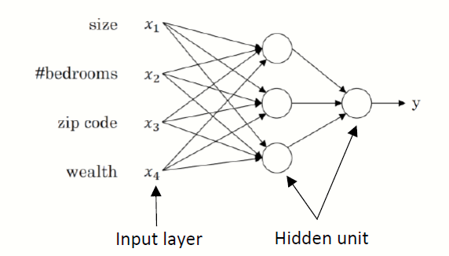

### Supervised Learning for Neural Networks
- [Lecture notes](notes/02_Supervised_Learning_for_Neural_Network.pdf)
- Supervised - regression and classification problems. Regression problem - predict results within a continuous output, trying to map input variables to some continuous function. Classification problem, we are instead trying to predict results in a discrete output, we are trying to map input variables into discrete categories.  
- Application of supervised learning <br>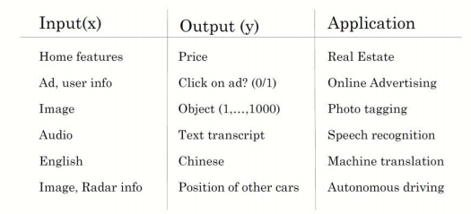
- Types of neural networks: **Convolution Neural Network (CNN)** used often for image application and **Recurrent Neural Network (RNN)** used for one-dimensional sequence data such as translating English to Chinses. As for the autonomous driving, it is a hybrid neural network architecture.
- Structured vs unstructured data <br>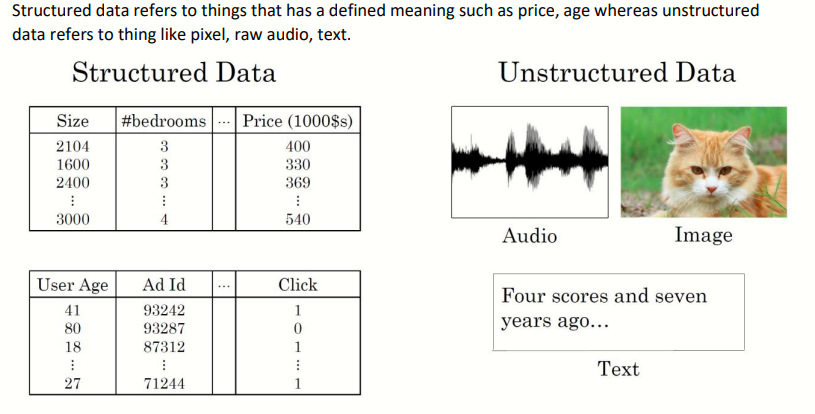

### Why is Deep Learning taking off?
- [Lecture notes](notes/03_Why_is_Deep_Learning_Taking_Off.pdf) 
- Large amount of data! We see that traditional algorithms reach to a threshold on performance. However, NN always works better with more data. So you can get better performance as long as you collecting more and more data, without changing the algorithm itself.
- 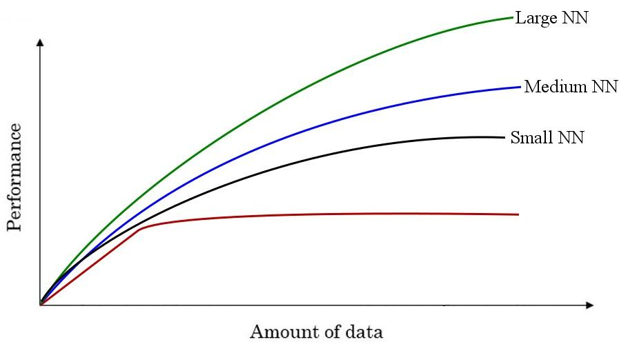


## Neural Networks Basics
> LogReg for NN, making prediction, derivative computation, and gradient descent | Compute LogReg using back prop | Python, NumPy, implement vectorization

### Binary Classification
- [Lecture notes](notes/04_Binary_Classification.pdf) 
- Here are some notations:
  - `M is the number of training vectors`
  - `Nx is the size of the input vector`
  - `Ny is the size of the output vector`
  - `X(1) is the first input vector`
  - `Y(1) is the first output vector`
  - `X = [x(1) x(2).. x(M)]`
  - `Y = (y(1) y(2).. y(M))`
### Logistic Regression
- [Lecture notes](notes/05_Logistic_Regression.pdf), [YouTube Video Part 1](https://www.youtube.com/watch?v=L_xBe7MbPwk) & [Part 2](https://www.youtube.com/watch?v=uFfsSgQgerw)
- Predict whether `0 or 1`, classification algorithm of 2 classes
- `y` to be in between `0 and 1` (probability): `y = sigmoid(w^T*x + b)`
- 

### Logistic Regression Cost Function
- [Lecture notes](notes/06_Logistic_Regression_Cost_Function.pdf), [YouTube Video](https://www.youtube.com/watch?v=MztgenIfGgM)
- The cost function measures the accuracy of our hypothesis function. Quantifies the error between predicted values and expected values. 
- Now we are able to concretely measure the accuracy of our predictor function (hypothesis) against the correct results we have so that we can predict new results we don't have.
- First loss function would be the square root error:` L(y',y) = 1/2 (y' - y)^2`
  - But we won't use this notation because it leads us to optimization problem which is non convex, means it contains local optimum points.
- This is the function that we will use: `L(y',y) = - (y*log(y') + (1-y)*log(1-y'))`
- To explain the last function lets see:
  - if `y = 1` ==> `L(y',1) = -log(y')` ==> we want y' to be the largest ==> y' biggest value is 1
  - if `y = 0` ==> `L(y',0) = -log(1-y')` ==> we want 1-y' to be the largest ==> y' to be smaller as possible because it can only has 1 value.
- Then the Cost function will be: `J(w,b) = (1/m) * Sum(L(y'[i],y[i]))`
- The loss function computes the error for a single training example; the cost function is the average of the loss functions of the entire training set.

### Gradient Descent
- *Gradient Descent* - so we have our hypothesis function and we have a way of measuring how well it fits into the data. Now we need to estimate the parameters in the hypothesis function. That's where gradient descent comes in.
- [YouTube video: What is the Gradient Descent?](https://www.youtube.com/watch?v=gzrQvzYEvYc)
- Gradient Descent basically just does what we were doing by hand — change the theta values, or parameters, bit by bit, until we hopefully arrived at a minimum. I am comparing it with a cost function right now. 
- We want to predict `w` and `b` that minimize the cost function.
- First we initialize `w` and `b` to 0, 0 or initialize them to a random value in the convex function and then try to improve the values the reach minimum value.
- The derivative give us the direction to improve our parameters.
- The actual equations we will implement:
  - `w = w - alpha * d(J(w,b) / dw)` (how much the function slopes in the w direction)
  - `b = b - alpha * d(J(w,b) / db)` (how much the function slopes in the d direction)
  - 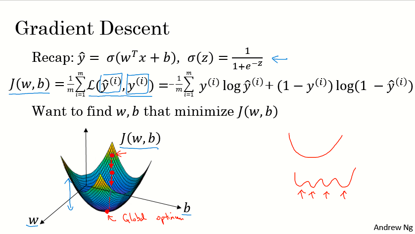 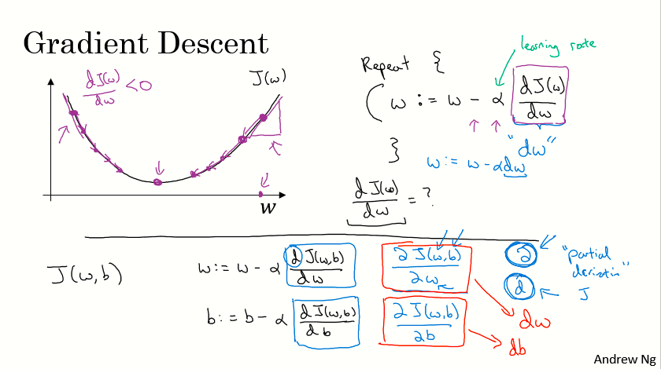 

### Derivatives
- Derivative of a linear line is its slope.
  - ex. `f(a) = 3a` `d(f(a))/d(a) = 3`
  - if `a = 2` then `f(a) = 6`
  - if we move a a little bit `a = 2.001` then `f(a) = 6.003` means that we multiplied the derivative (Slope) to the moved area and added it to the last result.
- To conclude, Derivative is the slope, and this slope is different in different points in the function thats why the derivative is a function.

### Derivatives with a Computation Graph
- Calculus chain rule says: If `x -> y -> z` (x effect y and y effects z) Then `d(z)/d(x) = d(z)/d(y) * d(y)/d(x)`
- Back prop for computing the derivatives
- 

### Logistic Regression Gradient Descent
- In the video were discussed the derivatives of gradient decent for a **single training example** with two features `x1` and `x2`.
- 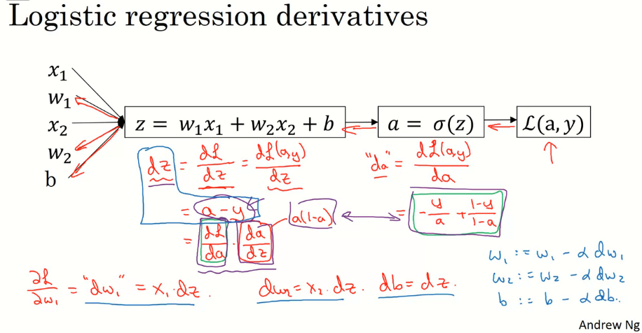

### Gradient Descent on *m* Examples
- Lets say we have these variables:
  ```
  	X1                  Feature
  	X2                  Feature
  	W1                  Weight of the first feature.
  	W2                  Weight of the second feature.
  	B                   Logistic Regression parameter.
  	M                   Number of training examples
  	Y(i)                Expected output of i
  ```
- So we have:
  

- Then from right to left we will calculate derivations compared to the result:

  ```
  	d(a)  = d(l)/d(a) = -(y/a) + ((1-y)/(1-a))
  	d(z)  = d(l)/d(z) = a - y
  	d(W1) = X1 * d(z)
  	d(W2) = X2 * d(z)
  	d(B)  = d(z)
  ```

- From the above we can conclude the logistic regression pseudo code:

  ```
  	J = 0; dw1 = 0; dw2 =0; db = 0;         # Devs.
  	w1 = 0; w2 = 0; b=0;					# Weights
  	for i = 1 to m
  		# Forward pass
  		z(i) = W1*x1(i) + W2*x2(i) + b
  		a(i) = Sigmoid(z(i))
  		J += (Y(i)*log(a(i)) + (1-Y(i))*log(1-a(i)))

  		# Backward pass
  		dz(i) = a(i) - Y(i)
  		dw1 += dz(i) * x1(i)
  		dw2 += dz(i) * x2(i)
  		db  += dz(i)
  	J /= m
  	dw1/= m
  	dw2/= m
  	db/= m

  	# Gradient descent
  	w1 = w1 - alpha * dw1
  	w2 = w2 - alpha * dw2
  	b = b - alpha * db
  ```

- The above code should run for some iterations to minimize error.

- So there will be two inner loops to implement the logistic regression.

- Vectorization is so important on deep learning to reduce loops. In the last code we can make the whole loop in one step using vectorization!

### Vectorization
- `for-loops` are slow. Thats why we need vectorization to get rid of some of our for loops.
- `a=random.rand(1000000) b=random.rand(1000000)` - NumPy library `numpy.dot(a, b)` function is using vectorization by default.
- The vectorization can be done on CPU or GPU thought the SIMD operation. But its faster on GPU.
- Whenever possible, avoid for-loops.
- Most of the NumPy library methods are vectorized version.

### Vectorizing Logistic Regression
- As an input we have a matrix `X` and its `[Nx, m]` and a matrix `Y` and its `[Ny, m]`.
- We will then compute at instance `[z1,z2...zm] = W' * X + [b,b,...b]`. This can be written in python as:
```python
  Z = np.dot(W.T,X) + b    # Vectorization, then broadcasting, Z shape is (1, m)
  A = 1 / 1 + np.exp(-Z)   # Vectorization, A shape is (1, m)
``` 
- Vectorizing Logistic Regression's Gradient Output
``` python
  dz = A - Y                  # Vectorization, dz shape is (1, m)
  dw = np.dot(X, dz.T) / m    # Vectorization, dw shape is (Nx, 1)
  db = dz.sum() / m           # Vectorization, dz shape is (1, 1)
```
- 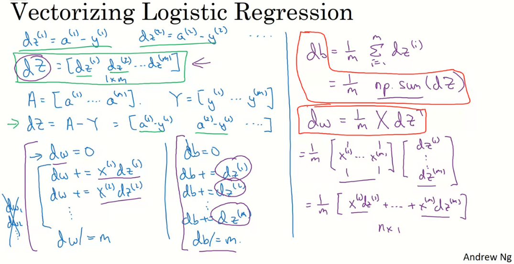 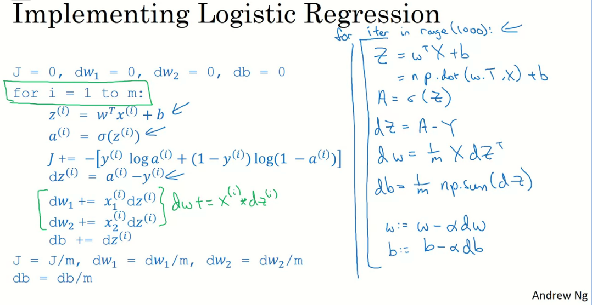

### Notes on Python and NumPy

- Some tricks to eliminate all the strange bugs in the code:
	- If you didn't specify the shape of a vector, it will take a shape of (m,) and the transpose operation won't work. You have to reshape it to (m, 1)
	- Try to not use the rank one matrix in ANN
	- Don't hesitate to use assert(a.shape == (5,1)) to check if your matrix shape is the required one.
	- If you've found a rank one matrix try to run reshape on it.
	```python
	a = np.random.randn(5)    # Rank 1 array (DON'T USE)
	assert(a.shape == (5, 1)) # checking the codition, if false AssertionError will be raised
	a = a.reshape((5, 1))     # Will change to vector
	b = np.random.randn(5, 1) # Column vector
	c = np.random.randn(1, 5) # Row vector
	c.shape 				  # Will output a shape (1, 5)
	```
- In NumPy, `obj.sum(axis = 0)` sums the columns while `obj.sum(axis = 1)` sums the rows.
- In NumPy, `obj.reshape(1,4)` changes the shape of the matrix by broadcasting the values.	
- Reshape is cheap in calculations so put it everywhere you're not sure about the calculations.
- Broadcasting works when you do a matrix operation with matrices that doesn't match for the operation, in this case NumPy automatically makes the shapes ready for the operation by broadcasting the values.
- In general principle of broadcasting. If you have an (m,n) matrix and you add(+) or subtract(-) or multiply(*) or divide(/) with a (1,n) matrix, then this will copy it m times into an (m,n) matrix (in case of sum). The same with if you use those operations with a (m , 1) matrix, then this will copy it n times into (m, n) matrix. And then apply the addition, subtraction, and multiplication of division element wise.
- To Compute the derivative of `Sigmoid`:
	```
	s = sigmoid(x)
	ds = s * (1 - s)       # Derivative  using calculus
	```
- To make an image of `(width,height,depth)` be a vector, use this:
	```
	v = image.reshape(image.shape[0]*image.shape[1]*image.shape[2], 1)  #reshapes the image.
	```
- Gradient descent converges faster after normalization of the input matrices.

### General Notes
- The main steps for building a Neural Network are:
	- Define the model structure (such as number of input features and outputs)
	- Initialize the model's parameters.
	- Loop:
		- Calculate current loss (forward propagation)
		- Calculate current gradient (backward propagation)
		- Update parameters (gradient descent)
- Preprocessing the dataset is important.
- Tuning the learning rate (which is an example of a "hyperparameter") can make a big difference to the algorithm.
- kaggle.com is a good place for datasets and competitions.

## Shallow neural networks: Week 2

> Learn to build a neural network with one hidden layer, using forward propagation and backpropagation.

### Neural Networks Overview

- In logistic regression we had:

  ```
  X1  \  
  X2   ==>  z = XW + B ==> a = Sigmoid(z) ==> L(a,Y)
  X3  /
  ```
    - 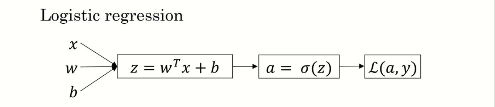

- In neural networks with one layer we will have:

  ```
  X1  \  
  X2   =>  z1 = XW1 + B1 => a1 = Sigmoid(z1) => z2 = a1W2 + B2 => a2 = Sigmoid(z2) => L(a2,Y)
  X3  /
  ```
    - 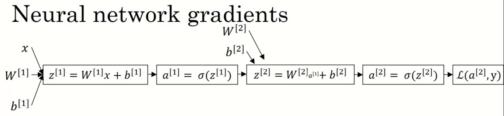

- `X` is the input vector `(X1, X2, X3)`, and `Y` is the output variable `(1x1)`
- NN is stack of logistic regression objects.

### Neural Network Representation

- We will define the neural networks that has one hidden layer.
- NN contains of input layers, hidden layers, output layers.
- Hidden layer means we cant see that layers in the training set.
- `a0 = x` (the input layer)
- `a1` will represent the activation of the hidden neurons.
- `a2` will represent the output layer.
- We are talking about 2 layers NN. The input layer isn't counted.

### Computing a Neural Network's Output

- Equations of Hidden layers:
  - 
- Here are some informations about the last image:
  - `noOfHiddenNeurons = 4`
  - `Nx = 3`
  - Shapes of the variables:
    - `W1` is the matrix of the first hidden layer, it has a shape of `(noOfHiddenNeurons,nx)`
    - `b1` is the matrix of the first hidden layer, it has a shape of `(noOfHiddenNeurons,1)`
    - `z1` is the result of the equation `z1 = W1*X + b`, it has a shape of `(noOfHiddenNeurons,1)`
    - `a1` is the result of the equation `a1 = sigmoid(z1)`, it has a shape of `(noOfHiddenNeurons,1)`
    - `W2` is the matrix of the second hidden layer, it has a shape of `(1,noOfHiddenNeurons)`
    - `b2` is the matrix of the second hidden layer, it has a shape of `(1,1)`
    - `z2` is the result of the equation `z2 = W2*a1 + b`, it has a shape of `(1,1)`
    - `a2` is the result of the equation `a2 = sigmoid(z2)`, it has a shape of `(1,1)`

### Vectorizing across multiple examples

- Pseudo code for forward propagation for the 2 layers NN:

  ```
  for i = 1 to m
    z[1, i] = W1*x[i] + b1      # shape of z[1, i] is (noOfHiddenNeurons,1)
    a[1, i] = sigmoid(z[1, i])  # shape of a[1, i] is (noOfHiddenNeurons,1)
    z[2, i] = W2*a[1, i] + b2   # shape of z[2, i] is (1,1)
    a[2, i] = sigmoid(z[2, i])  # shape of a[2, i] is (1,1)
  ```

- Lets say we have `X` on shape `(Nx,m)`. So the new pseudo code:

  ```
  Z1 = W1X + b1     # shape of Z1 (noOfHiddenNeurons,m)
  A1 = sigmoid(Z1)  # shape of A1 (noOfHiddenNeurons,m)
  Z2 = W2A1 + b2    # shape of Z2 is (1,m)
  A2 = sigmoid(Z2)  # shape of A2 is (1,m)
  ```

- If you notice always m is the number of columns.
- In the last example we can call `X` = `A0`. So the previous step can be rewritten as:

  ```
  Z1 = W1A0 + b1    # shape of Z1 (noOfHiddenNeurons,m)
  A1 = sigmoid(Z1)  # shape of A1 (noOfHiddenNeurons,m)
  Z2 = W2A1 + b2    # shape of Z2 is (1,m)
  A2 = sigmoid(Z2)  # shape of A2 is (1,m)
  ```
- 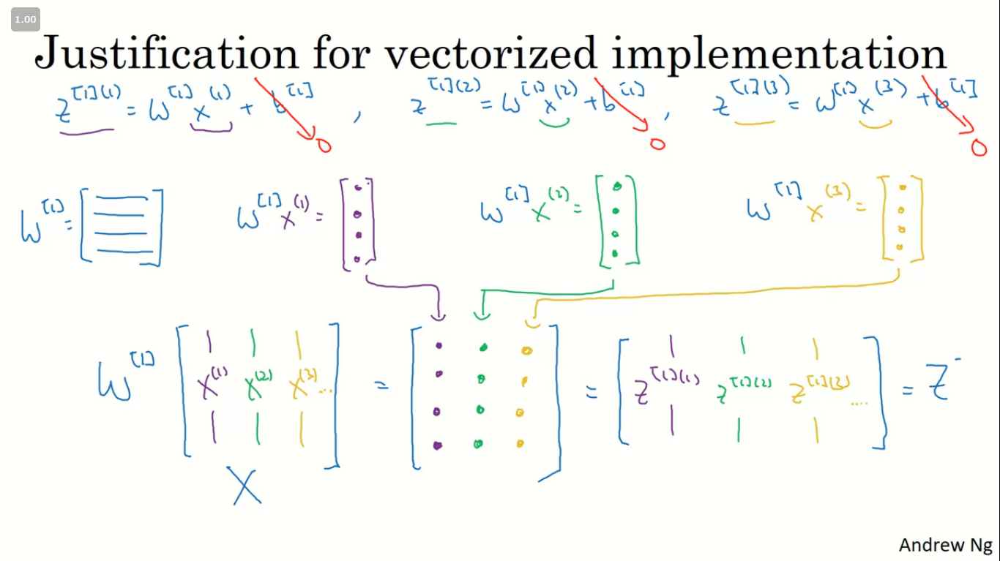 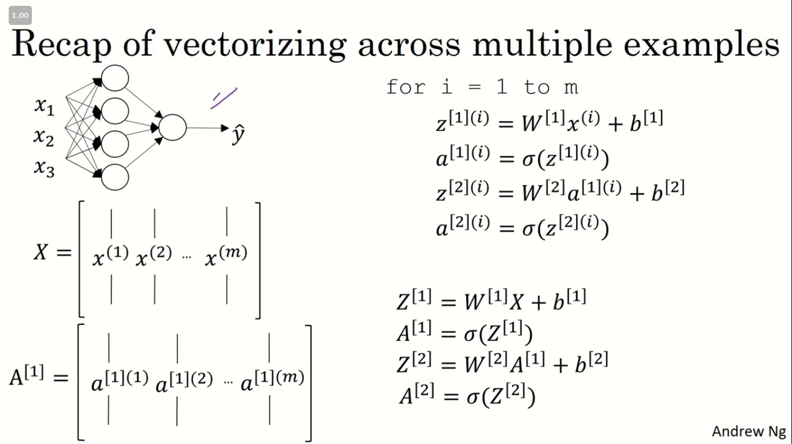

### What is the difference between neural network and logistic regression? 
- Neural Network is the generalized form of logistic regression
- https://www.quora.com/What-is-the-difference-between-neural-network-and-logistic-regression
- Look at backprob intuition below 

### Activation fanction
- So far we are using sigmoid, but in some cases other functions can be a lot better.

- Sigmoid can lead us to gradient decent problem where the updates are so low.

- Sigmoid activation function range is `[0,1] A = 1 / (1 + np.exp(-z))` # Where z is the input matrix

- `Tanh` activation function range is `[-1,1]` (Shifted version of sigmoid function)
  - n NumPy we can implement Tanh using one of these methods: `A = (np.exp(z) - np.exp(-z)) / (np.exp(z) + np.exp(-z)) # Where z is the input matrix`

  - Or `A = np.tanh(z) # Where z is the input matrix`

- It turns out that the `tanh` activation usually works better than `sigmoid` activation function for hidden units because the mean of its output is closer to zero, and so it centers the data better for the next layer.

- `Sigmoid` or `Tanh` function disadvantage is that if the input is too small or too high, the slope will be near zero which will cause us the gradient decent problem.

- One of the popular activation functions that solved the slow gradient decent is the RELU function. `RELU = max(0,z) # so if z is negative the slope is 0 and if z is positive the slope remains linear.`

- So here is some basic rule for choosing activation functions, if your classification is between 0 and 1, use the output activation as sigmoid and the others as `RELU`.

- `Leaky RELU `activation function different of RELU is that if the input is negative the slope will be so small. It works as RELU but most people uses RELU. `Leaky_RELU = max(0.01z,z) #the 0.01 can be a parameter for your algorithm.`

- In NN you will decide a lot of choices like:
  - No. of hidden layers.
  - No. of neurons in each hidden layer.
  - Learning rate. (The most important parameter)
  - Activation functions.
  - And others..

- It turns out there are no guide lines for that. You should try all activation functions for example.

### Why do you need non-linear activation functions?
- If we removed the activation function from our algorithm that can be called linear activation function.
- Linear activation function will output linear activations
  - Whatever hidden layers you add, the activation will be always linear like logistic regression (So its useless in a lot of complex problems)
- You might use linear activation function in one place - in the output layer if the output is real numbers (regression problem). But even in this case if the output value is non-negative you could use RELU instead.

### Derivatives of activation functions
- Derivation of Sigmoid activation function:
```
g(z)  = 1 / (1 + np.exp(-z))
g'(z) = (1 / (1 + np.exp(-z))) * (1 - (1 / (1 + np.exp(-z))))
g'(z) = g(z) * (1 - g(z))
```

- Derivation of Tanh activation function:
```
g(z)  = (e^z - e^-z) / (e^z + e^-z)
g'(z) = 1 - np.tanh(z)^2 = 1 - g(z)^2
```
- Derivation of RELU activation function:
```
g(z)  = np.maximum(0,z)
g'(z) = { 0  if z < 0
          1  if z >= 0  }
```
- Derivation of leaky RELU activation function:
```
g(z)  = np.maximum(0.01 * z, z)
g'(z) = { 0.01  if z < 0
          1     if z >= 0 }                
```

### Gradient descent for Neural Networks
- Gradient descent algorithm:

  - NN parameters:
    ```  n[0] = Nx
      n[1] = NoOfHiddenNeurons
      n[2] = NoOfOutputNeurons = 1
      W1 shape is (n[1],n[0])
      b1 shape is (n[1],1)
      W2 shape is (n[2],n[1])
      b2 shape is (n[2],1)
      Cost function I = I(W1, b1, W2, b2) = (1/m) * Sum(L(Y,A2))
    ```
  - Cost function `I = I(W1, b1, W2, b2) = (1/m) * Sum(L(Y,A2))`
  - Then Gradient descent:
    ```
      Repeat:
            Compute predictions (y'[i], i = 0,...m)
            Get derivatives: dW1, db1, dW2, db2
            Update: W1 = W1 - LearningRate * dW1
                b1 = b1 - LearningRate * db1
                W2 = W2 - LearningRate * dW2
                b2 = b2 - LearningRate * db2
    ```
- Forward propagation:
  ```
    Z1 = W1A0 + b1    # A0 is X
    A1 = g1(Z1)
    Z2 = W2A1 + b2
    A2 = Sigmoid(Z2)      # Sigmoid because the output is between 0 and 1
  ```
- Backpropagation (derivations):

  ```  
    dZ2 = A2 - Y      # derivative of cost function we used * derivative of the sigmoid function
    dW2 = (dZ2 * A1.T) / m
    db2 = Sum(dZ2) / m
    dZ1 = (W2.T * dZ2) * g'1(Z1)  # element wise product (*)
    dW1 = (dZ1 * A0.T) / m   # A0 = X
    db1 = Sum(dZ1) / m
    # Hint there are transposes with multiplication because to keep dimensions correct
    ```

### Backprop intuition
- https://www.youtube.com/watch?v=mH9GBJ6og5A&list=PLZoTAELRMXVPGU70ZGsckrMdr0FteeRUi&index=5
- Logistic regression we had:
  - 
  - 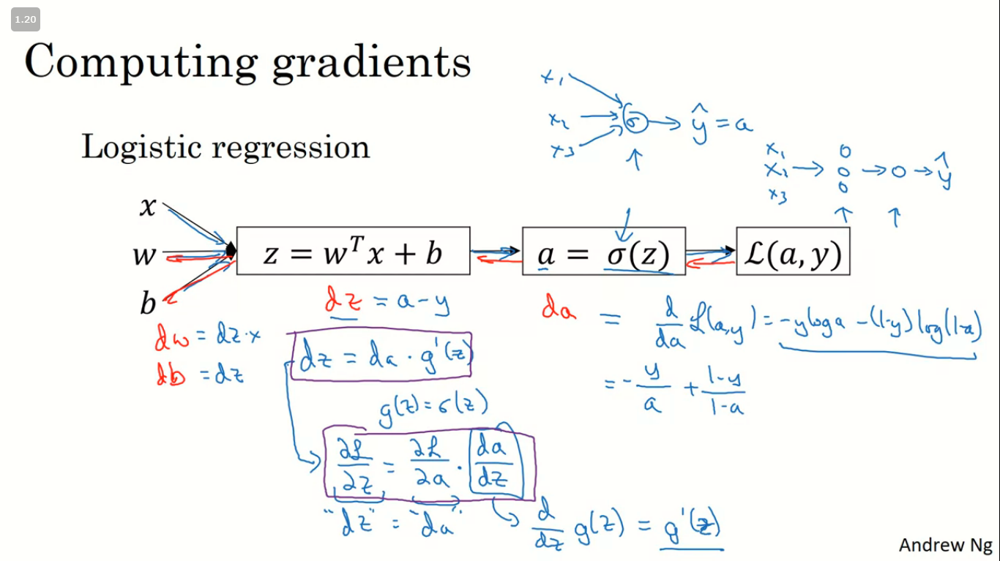
- In Neural Network we have:
  - 
  - 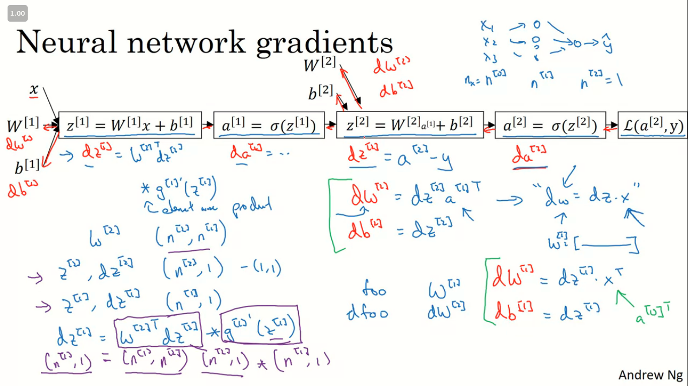
  -  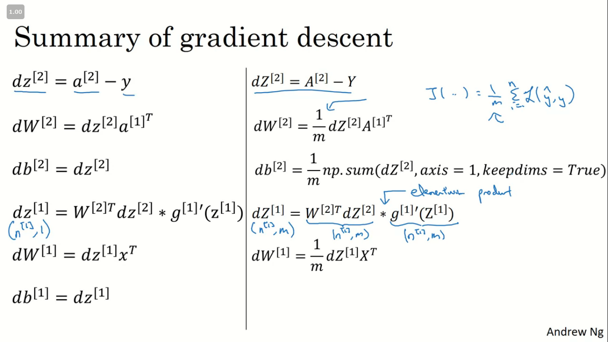 
  - 
  
### Random Initialization
- In logistic regression it wasn't important to initialize the weights randomly, while in NN we have to initialize them randomly.

- If we initialize all the weights with zeros in NN it won't work (initializing bias with zero is OK):
  - all hidden units will be completely identical (symmetric) - compute exactly the same function
  - on each gradient descent iteration all the hidden units will always update the same

- To solve this we initialize the W's with a small random numbers:
  ```
  W1 = np.random.randn((2,2)) * 0.01    # 0.01 to make it small enough
  b1 = np.zeros((2,1))                  # its ok to have b as zero, it won't get us to the symmetry breaking problem
  ```

- We need small values because in `sigmoid` (or `tanh`), for example, if the weight is too large you are more likely to end up even at the very start of training with very large values of Z. Which causes your `tanh` or your `sigmoid` activation function to be saturated, thus slowing down learning. If you don't have any `sigmoid` or `tanh` activation functions throughout your neural network, this is less of an issue.

- Constant `0.01` is alright for 1 hidden layer networks, but if the NN is deep this number can be changed but it will always be a small number.

### General Notes
- The general methodology to build a Neural Network is to:
  1. Define the neural network structure ( # of input units,  # of hidden units, etc). 
  2. Initialize the model's parameters
  3. Loop:
      - Implement forward propagation
      - Compute loss
      - Implement backward propagation to get the gradients
      - Update parameters (gradient descent)


## Deep Neural Networks: Week 3
> Understand the key computations underlying deep learning, use them to build and train deep neural networks, and apply it to computer vision. Build and train a deep L-layer Neural Network.

### Deep L-layer neural network
- Shallow NN is a NN with one (Logisic Regression) or two layers.
- We are not coundting the input layer (features layer).
- Deep NN is a NN with three or more layers.
- We will use the notation `L` to denote the number of layers in a NN.
- `n[l]` is the number of neurons in a specific layer `l`.
- Similarly, `n[0]` denotes the number of neurons `input` layer. `n[L]` denotes the number of neurons in `output` layer.
- `g[l]` is the activation function.
- `a[l] = g[l](z[l])`
- `w[l]` weights is used for `z[l]`
- `x = a[0]`, `a[l] = y'`
- These were the notation we will use for deep neural network.
- So we have:
  - A vector `n` of shape `(1, NoOfLayers+1)`
  - A vector `g` of shape `(1, NoOfLayers)`
  - A list of different shapes `w` based on the number of neurons on the previous and the current layer.
  - A list of different shapes `b` based on the number of neurons on the current layer.

### Forward Propagation in a Deep Network

