# [Improving Deep Neural Networks: Hyperparameter tuning, Regularization and Optimization](https://www.coursera.org/learn/deep-neural-network)

    - Train/dev/test sets
    - Regularization, dropout technique, normalizing inputs, gradient checking
    - Optimization algos (mini-batch GD, GD with momentum, RMS, Adam optimization)
    - Hyperparameters tuning (logarithmic scale), batch normalization
    - Multiclass classification, TensorFlow

<a href="https://www.coursera.org/account/accomplishments/certificate/VZSUJ4L9ZEKJ">
    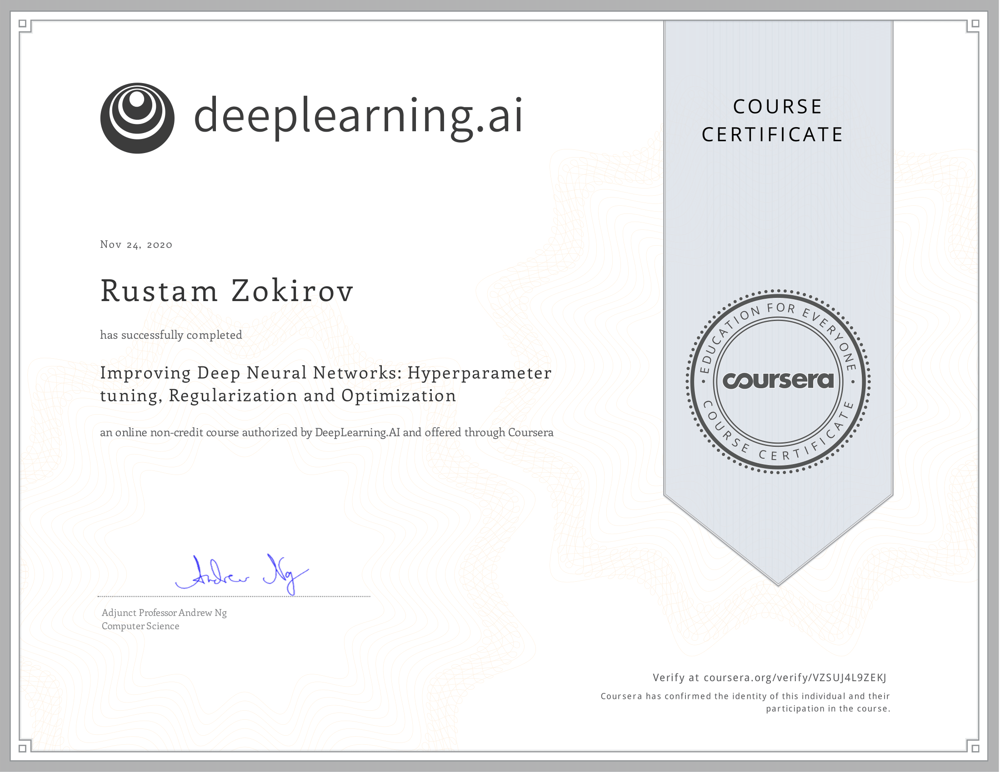
</a>

## Labs:
- [Initialization](https://www.coursera.org/learn/deep-neural-network/ungradedLab/p81Pk/initialization), implementing random initialization, [notebook](https://www.coursera.org/learn/deep-neural-network/ungradedLab/p81Pk/lab)
- [Regularization](https://www.coursera.org/learn/deep-neural-network/ungradedLab/xioPP/regularization), implementing regularization, understand what is the regularization, [notebook](https://www.coursera.org/learn/deep-neural-network/ungradedLab/xioPP/lab)
- [Gradient Checking](https://www.coursera.org/learn/deep-neural-network/ungradedLab/gjSPw/gradient-checking), [notebook](https://www.coursera.org/learn/deep-neural-network/ungradedLab/gjSPw/lab)
- [Optimization](https://www.coursera.org/learn/deep-neural-network/ungradedLab/hMnJ2/optimization), Adam & RMS prop, mini-batch GD, GD with momemtum, [notebook](https://www.coursera.org/learn/deep-neural-network/ungradedLab/hMnJ2/lab)
- [TensorFlow](#https://www.coursera.org/learn/deep-neural-network/ungradedLab/9xqJ2/tensorflow), hands detection, [notebook](https://www.coursera.org/learn/deep-neural-network/ungradedLab/9xqJ2/lab)

## Contents:
- [Week 1: Practical aspects of Deep Learning](#Week-1:-Practical-aspects-of-Deep-Learning)
    - Setting up your Machine Learning Application
        - [Train/Dev/Test sets](#Train/Dev/Test-sets)
        - [Bias/Variance](#Bias/Variance)
        - [Basic Recipe for ML (what to do if you have high bias/variance)](#Basic-Recipe-for-Machine-Learning)
    - Regularizing your neural network
        - [Regularization](#Regularization)
        - [Dropout regularization, understanding dropout](#Dropout-regularization)
        - [Other regularization methods](#Other-regularization-methods)
    - Setting up your optimization problem
        - [Normalizing inputs](#Normalizing-inputs)
        - [Vanishing/exploding gradients](#Vanishing/Exploding-gradients)
        - Weight Initialization for Deep Networks
        - [Numerical approximation of gradients](#Numerical-approximation-of-gradients)
        - [Gradient checking, implementation notes](#Gradient-checking-implementation-notes)
        - [General Notes: Dropout](#general-notes)
- [Week 2: Optimization algorithms](#Week-2:-Optimization-algorithms)
    - [Mini-batch gradient descent](#Mini-batch-gradient-descent)
    - [Understanding mini-batch gradient descent](#Understanding-mini-batch-gradient-descent)
    - Exponentially weighted averages
    - [Gradient descent with momentum](#Gradient-descent-with-momentum)
    - [RMSprop](#RMSprop)
    - [Adam optimization algorithm](#Adam-optimization-algorithm)
    - [Learning rate decay](#Learning-rate-decay)
    - The problem of local optima (unlikely to get stuck, because of high dimensionality)
- [Week 3: Hyperparameter tuning, Batch Normalization and Programming Frameworks](#Week-3)
    - Hyperparameter tuning
        - Tuning process
        - Using an appropriate scale to pick hyperparameters (use logarithmic scale)
        - Hyperparameters tuning in practice: Pandas vs. Caviar
    - Batch Normalization
        - [Normalizing activations in a network](#Normalizing-activations-in-a-network)
    - Multi-class classification
    - TensorFlow

## Week 1: Practical aspects of Deep Learning
### Train/Dev/Test sets
- **Idea <-> Code <-> Experiment**, it's impossible to get all hyperparameters right on a new application from the first time.
- Your data will be split into three parts:
    - Training set. (Has to be the largest set)
    - Hold-out cross validation set / Development or "dev" set.
    - Testing set.

- You will try to build a model upon training set then try to optimize hyperparameters on dev set as much as possible. Then after your model is ready you try and evaluate the testing set.
- If you have 10,000,000 examples, split as `98% train`, `1% dev`, `1% test`
- The `dev` and `test` set should come from the same distribution

### Bias/Variance
- Underfitting --> high bias
- Overfitting --> high variance
- Your model will be alright if you balance the Bias / Variance
- 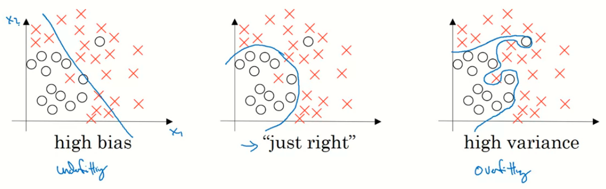
- High Bias (underfitting)
    - Training error = 15%
    - Dev error = 14%   
- High variance (overfitting)
    - Training error = 1%
    - Dev error = 11%
- High bias && high variance
    - Training error = 15%
    - Test error = 30%
- Best, if both of them are very small (0.5% and 1%)

### Basic Recipe for Machine Learning
- If your algorithm has a **high bias**:
    - Try to make your NN bigger (size of hidden units, number of layers)
    - Try a different model that is suitable for your data.
    - Try to run it longer.
    - Different (advanced) optimization algorithms.

- If your algorithm has a **high variance**:
    - Get more data.
    - Add regularization.
    - Use L2 Regularization, dropout, data augmentation

### Regularization
- https://towardsdatascience.com/regularization-in-machine-learning-76441ddcf99a
- Adding regularization to NN will help it reduce variance (overfitting)
- L1 matrix norm: `||W|| = Sum(|w[i,j]|)` # sum of absolute values of all w
- L2 matrix norm: `||W||^2 = Sum(|w[i,j]|^2)` # sum of all w squared --> `||W||^2 = W.T * W` if W is a vector
- Regularization for Logistic regression
    - Cost function is `J(w,b) = (1/m) * Sum(L(y(i),y'(i)))`
    - L1 regularization: `J(w,b) = (1/m) * Sum(L(y(i),y'(i))) + (lambda/2m) * Sum(|w[i]|)`
    - L2 regularization: `J(w,b) = (1/m) * Sum(L(y(i),y'(i))) + (lambda/2m) * Sum(|w[i]|^2)`
    - `lambda` is the regularization parameter (hyperparameter)
        - when you increase lambda, weights becoming smaller (closer to 0)
- Regularization for neural network
    - Cost function is `J(W1, b1, ... WL, bL) = (1/m) * Sum(L(y(i),y'(i)))`
    - L2 regularization: `J(w,b) = (1/m) * Sum(L(y(i),y'(i))) + (lambda/2m) * Sum((||W[l]||^2)`
    - Back prop: `dw[l] = (from back propagation) + lambda/m * w[l]`
    - Wights: `w[l] = (1 - (learning_rate*lambda)/m) * w[l] - learning_rate * (from back propagation)`
- *Weight decay* `(1 - (learning_rate*lambda)/m)` - a regularization technique (such as L2 regularization) that results in gradient descent shrinking the weights on every iteration.

### Dropout regularization
- The *dropout regularization* eliminates some neurons/weights on each iteration based on a probability
- 
    ``` 
    keep_prob = 0.8   # 0 <= keep_prob <= 1
    l = 3  # this code is only for layer 3
    # the generated number that are less than 0.8 will be dropped. 80% stay, 20% dropped
    d3 = np.random.rand(a[l].shape[0], a[l].shape[1]) < keep_prob

    a3 = np.multiply(a3,d3)   # keep only the values in d3

    # increase a3 to not reduce the expected value of output
    # (ensures that the expected value of a3 remains the same) - to solve the scaling problem
    a3 = a3 / keep_prob 
    ```
- Increasing the parameter `keep_prob` will reduce regularization effect

### Other regularization methods
- **Data augmentation**
    - In CV you can flip all your pictures horizontally this will give you m more data instances
    - You could also apply a random position and rotation to an image to get more data

- **Early stopping**
    

- **Model Ensembles**
    - Train multiple independent models
    - At test time average their results
    - It can get you extra 2% performance

### Normalizing inputs
- It makes the cost function faster to optimize.

- Normalization are going on these steps:
    1. Get the mean of the training set: `mean = (1/m) * sum(x(i))`
    2. Subtract the mean from each input: `X = X - mean`. This makes your inputs centered around 0.
    3. Get the variance of the training set: `variance = (1/m) * sum(x(i)^2)`
    4. Normalize the variance: `X /= variance`

### Vanishing/Exploding gradients
- The Vanishing / Exploding gradients occurs when your derivatives become very small or very big.
- If `W > I` (Identity matrix) the activation and gradients will `explode`.
    ```
    if W[l] = [1.5   0] 
              [0   1.5] (l != L because of different dimensions in the output layer)
    Y' = W[L] [1.5  0]^(L-1) X = 1.5^L 	# which will be very large
              [0  1.5]
    ```
- If `W < I` (Identity matrix) the activation and gradients will `vanish`.
    ```
    if W[l] = [0.5  0]
              [0  0.5]
    Y' = W[L] [0.5  0]^(L-1) X = 0.5^L 	# which will be very small
              [0  0.5]
    ```

### Weight Initialization for Deep Networks
- A partial solution to the Vanishing / Exploding gradients in NN is better or more careful choice of the random initialization of weights
- For `tanh()` `np.random.rand(shape) * np.sqrt(1/n[l-1])`   
- For `ReLU` `np.random.rand(shape) * np.sqrt(2/n[l-1])`

### Numerical approximation of gradients
- radient checking which tells you if implementation of backpropagation is correct.
- Use ONLY for DEBUGGING! Because it is slow than gradient descent
- Gradient checking
    - Take `W[1], b[1], ... W[L], b[L]` and reshape into one big vector (theta)
    - The cost function will be `J(theta)`
    - Then take `dW[1], db[1], ... dW[L], db[L]` into one big vector (d_theta)
    - Algorithm
        ```
        eps = 10^-7   # small number
        for i in len(theta):
            d_theta_approx[i] = (J(theta1,...,theta[i] + eps) -  J(theta1,...,theta[i] - eps)) / 2*eps
        ```
    - Finally we evaluate this formula (`||d_theta_approx - d_theta||) / (||d_theta_approx||+||d_theta||`) (`||` - Euclidean vector norm) and check (with eps = 10^-7):
        - great if `<10^-7`, the backpropagation is correct
        - normal if `~10^-5`, but need to inspect if there are no particularly big values in `d_theta_approx - d_theta` vector
        - bad if `>=10^-3`, probably there is a bug in backpropagation implementation

### Gradient checking implementation notes
- Don't use the gradient checking algorithm at training time because it's very slow.
- Use gradient checking only for debugging.
- If algorithm fails grad check, look at components to try to identify the bug.
- Gradient checking doesn't work with dropout because `J` is not consistent.
    - You can first turn off dropout (set `keep_prob = 1.0`), run gradient checking and then turn on dropout again.
- The weights `W[l]` should be initialized randomly to break symmetry, but initialize the biases `b[l]` to zeros.
- Don't intialize to values that are too large.

### General Notes
- 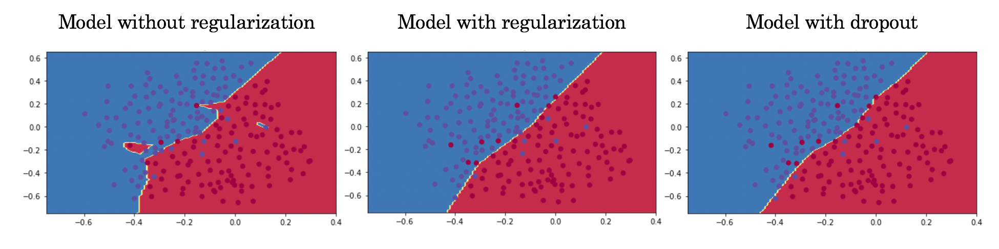
- **Dropout** is a regularization technique.
- You only use dropout during training. Don't use dropout (randomly eliminate nodes) during test time.
- Apply dropout both during forward and backward propagation.
- During training time, divide each dropout layer by keep_prob to keep the same expected value for the activations. For example, if keep_prob is 0.5, then we will on average shut down half the nodes, so the output will be scaled by 0.5 since only the remaining half are contributing to the solution. Dividing by 0.5 is equivalent to multiplying by 2. Hence, the output now has the same expected value. You can check that this works even when keep_prob is other values than 0.5.

## Week 2: Optimization algorithms
### Mini-batch gradient descent
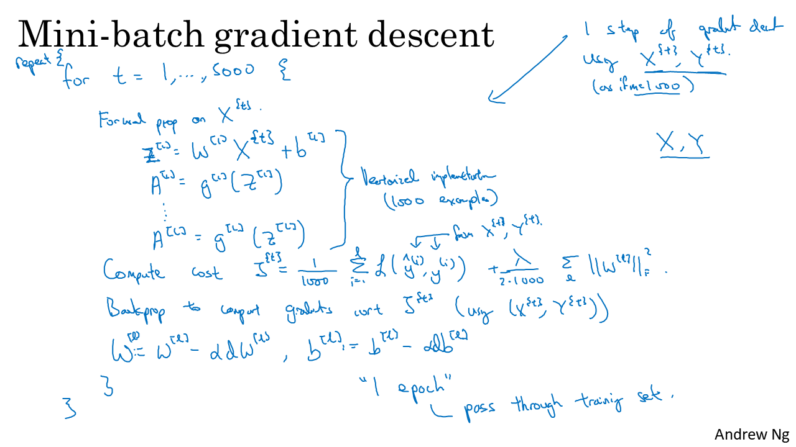

### Understanding mini-batch gradient descent
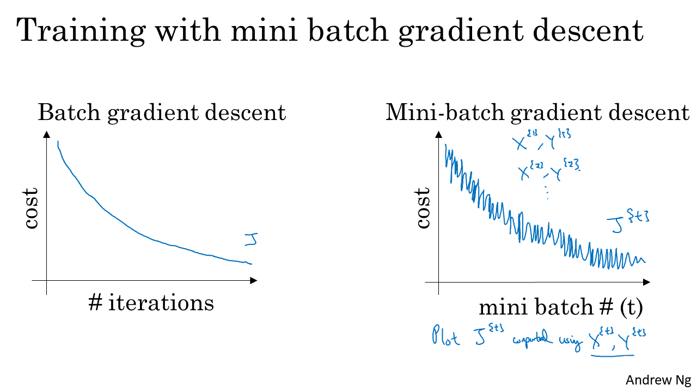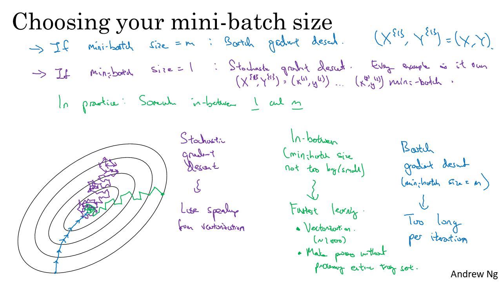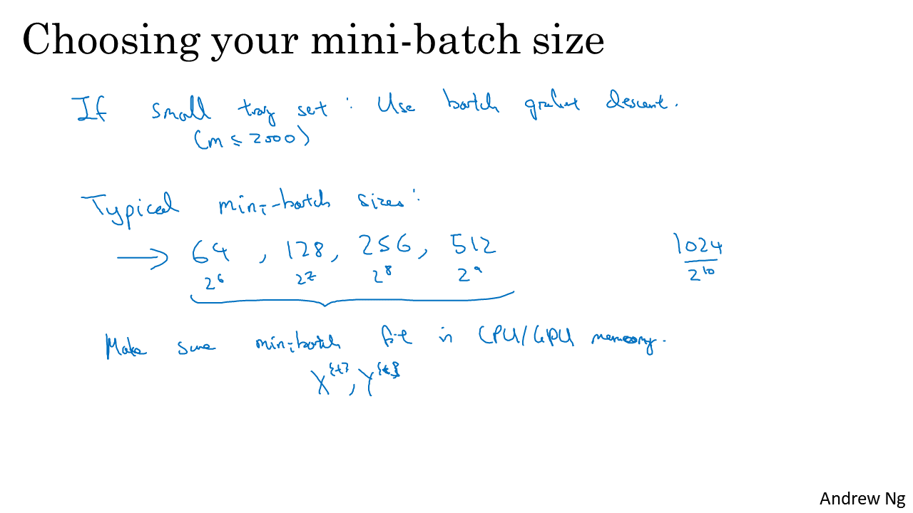

### Gradient descent with momentum
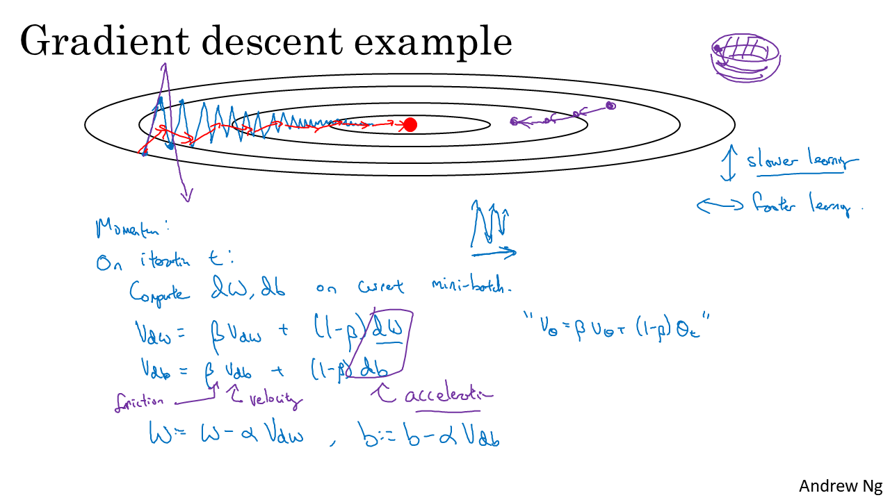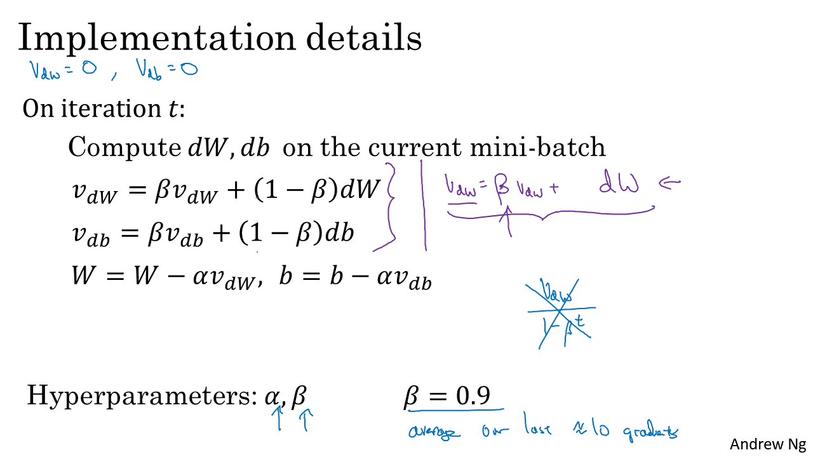
- The momentum algorithm almost always works faster than standard gradient descent.

### RMSprop
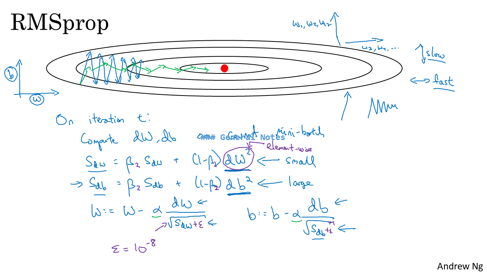
- Stands for **Root mean square prop**.
- This algorithm speeds up the gradient descent.

### Adam optimization algorithm
- Adam optimization simply puts RMSprop and momentum together!
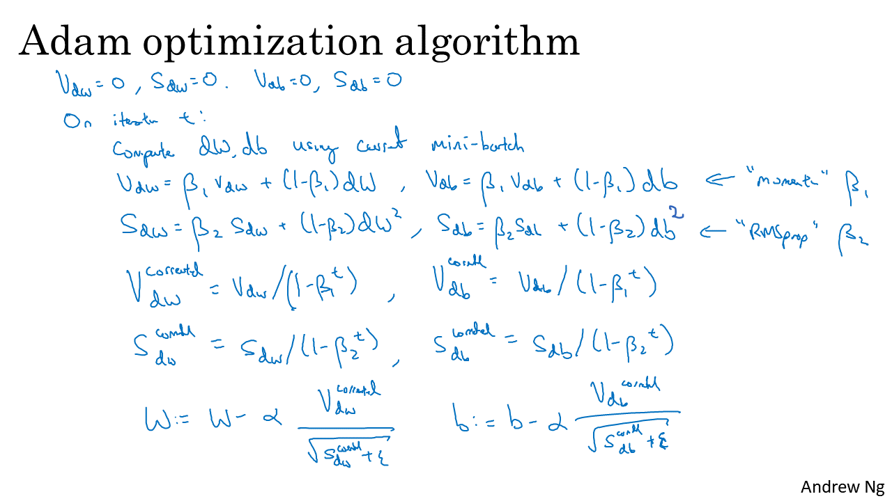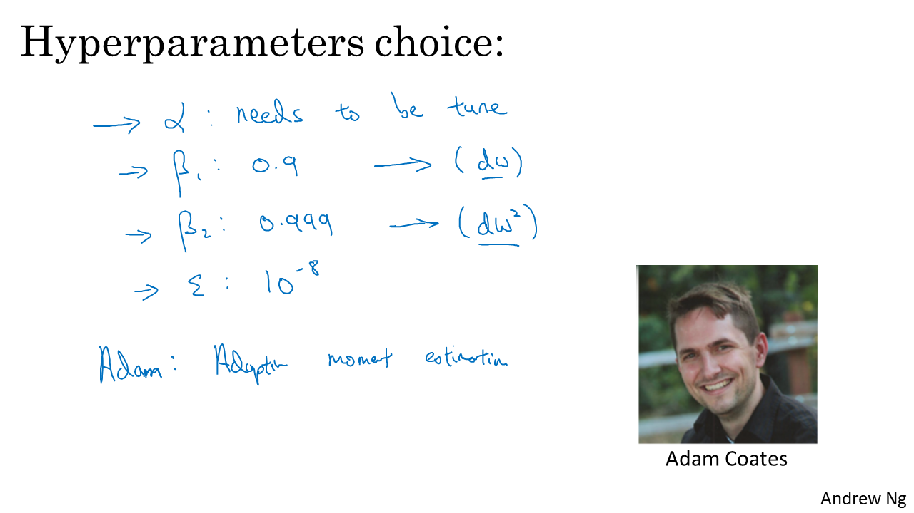

### Learning rate decay
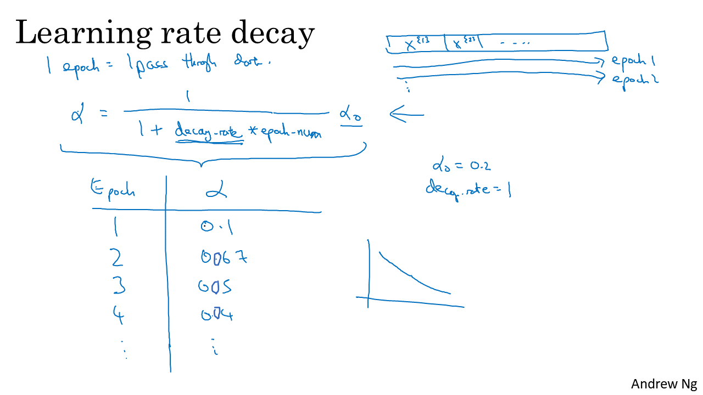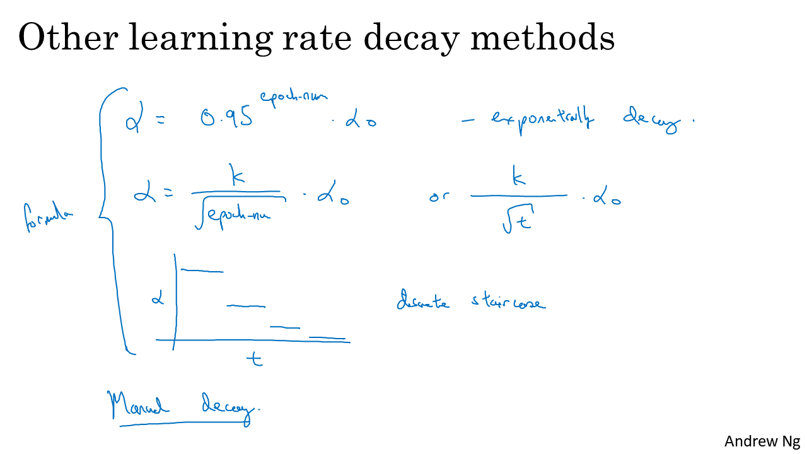

## Week 3
- Hyperparameter tuning, Batch Normalization and Programming Frameworks

### Normalizing activations in a network
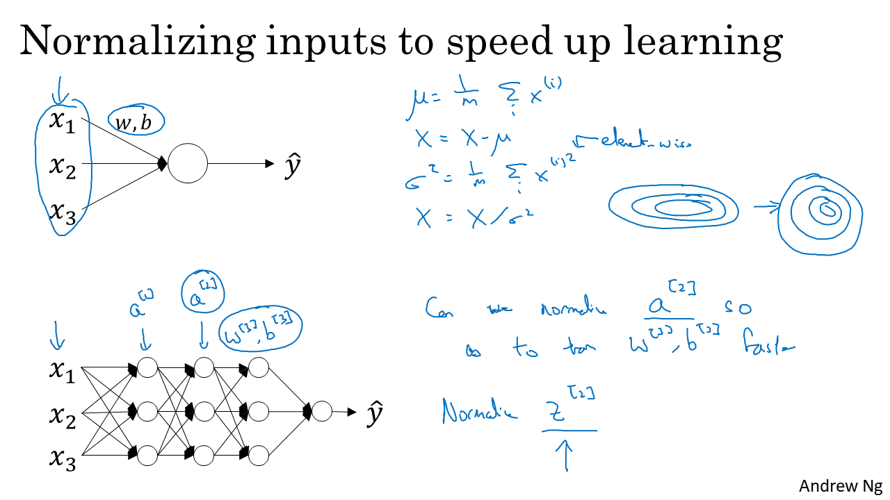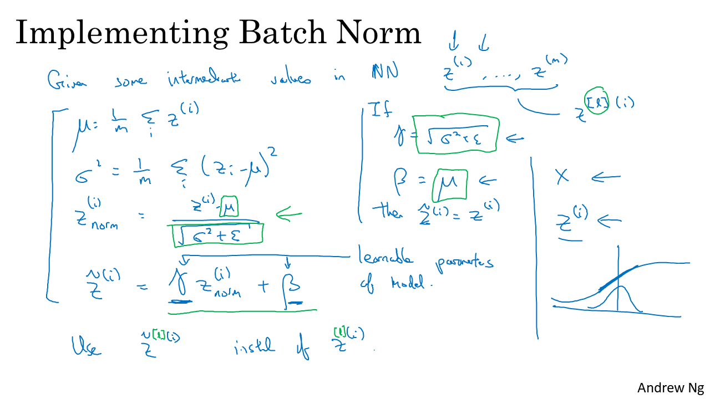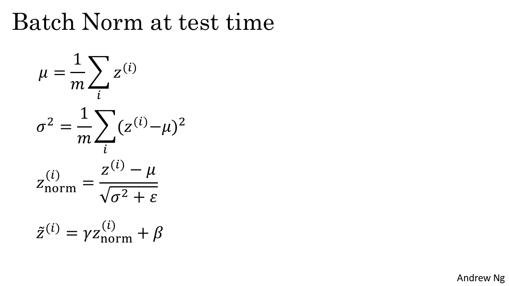
