# [Structuring Machine Learning Projects](https://www.coursera.org/learn/machine-learning-projects)

[Coursera Certificate](Coursera-WRWECF27GCYE.pdf)

- How to build a successful machine learning projects

- How to prioritize the problem

- ML strategy

- Choose a correct train/dev/test split of your dataset

- Human-level performance (Bayes error)

## Content
- Week 1
    - Introduction to ML strategy
        - [Why ML strategy](#Why-ML-strategy)

        - [Orthogonalization](#Orthogonalization)

    - Setting up your goal
        - [Single number evaluation metric](#Single-number-evaluation-metric)

        - [Satisficing and Optimizing metric](#Satisficing-and-Optimizing-metric)

        - [Train/dev/test distributions](#Train/dev/test-distributions)

        - [Size of the dev and test sets](#Size-of-the-dev-and-test-sets)

        - [When to change dev/test sets and metrics](#When-to-change-dev-test-sets-and-metrics)

    - Comparing to human-level performance
        - [Why human level performance](#Why-human-level-performance)

        - [Avoidable bias](#Avoidable-bias)

        - [Surpassing human-level performance](#Surpassing-human-level-performance)

        - [Improving your model performance](#Improving-your-model-performance) (summary)

    - [Bird recognition](Bird_recognition_in_the_city_of_Peacetopia.pdf) (case study)

- Week 2
    - Error Analysis
        - Carrying out error analysis

        - Cleaning up incorrectly labeled data

        - Build your first system quickly, then iterate

    - Mismatched training and dev/test set
        - Training and testing on different distributions

        - Bias and Variance with mismatched data distributions

    - Learning from multiple tasks
        - Transfer learning

    - End-to-end deep learning
        - What is end-to-end deep learning?

        - Whether to use end-to-end deep learning

    - [Autonomous driving](Autonomous_driving.pdf) (case study)

## Week 1: Introduction to ML strategy

### Why ML strategy
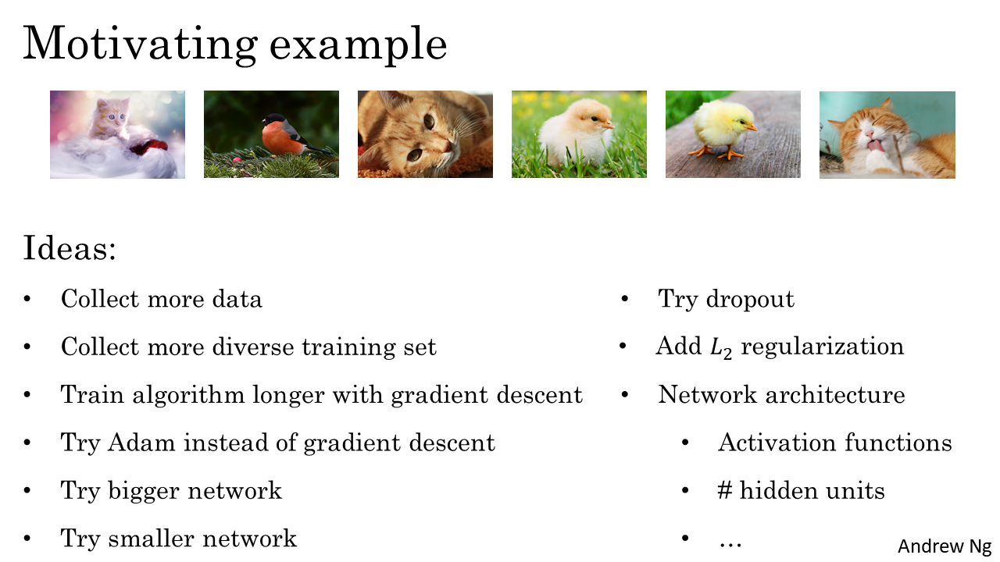

### Orthogonalization
[Supplemental notes](Orthogonalization.pdf)

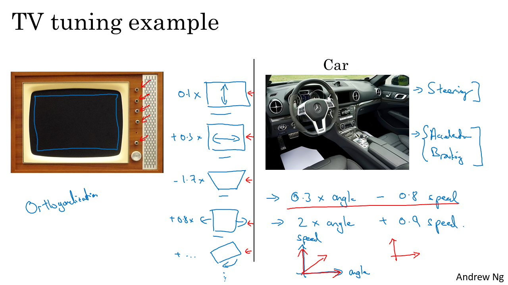
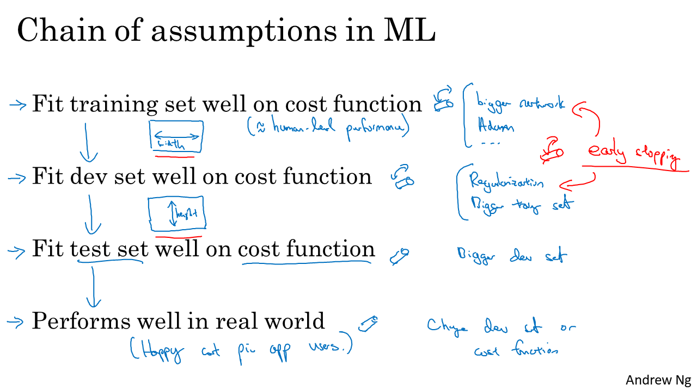

### Single number evaluation metric
[Supplemental notes](Single_number_evaluation_metric-2.pdf)

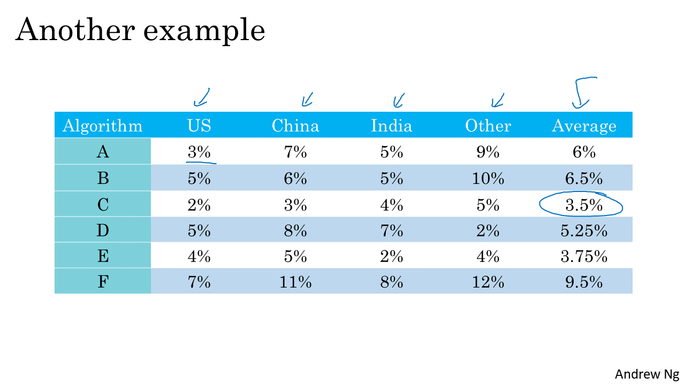

### Satisficing and Optimizing metric
[Supplemental notes](Satisficing_and_optimizing_metric.pdf)

### Train/dev/test distributions
[Supplemental notes](Training_development_and_test_distributions.pdf)

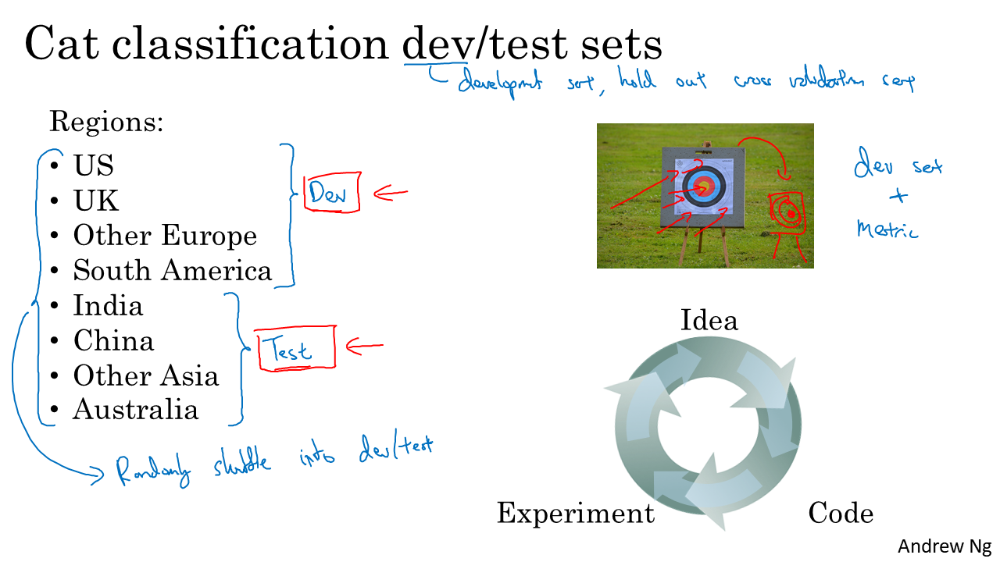
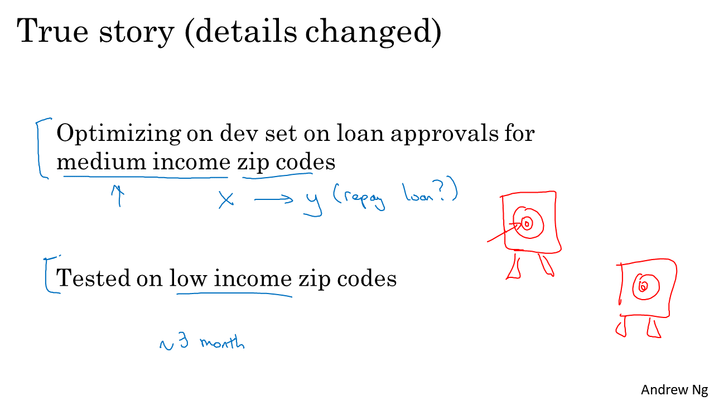
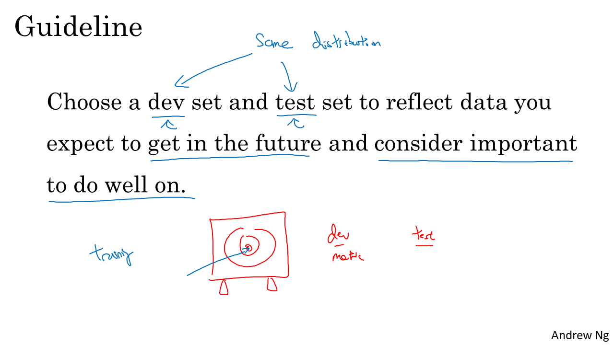

- Setting up the `training`, `development` and `test` sets have a huge impact on productivity. It is important to choose the `development` and `test` sets from the **same distribution** and it must be taken randomly from all the data.

- Guideline: Choose a `development` set and `test` set to reflect data you expect to get in the future and consider
important to do well.

### Size of the dev and test sets
[Supplemental notes](Size_of_the_development_and_test_sets.pdf)

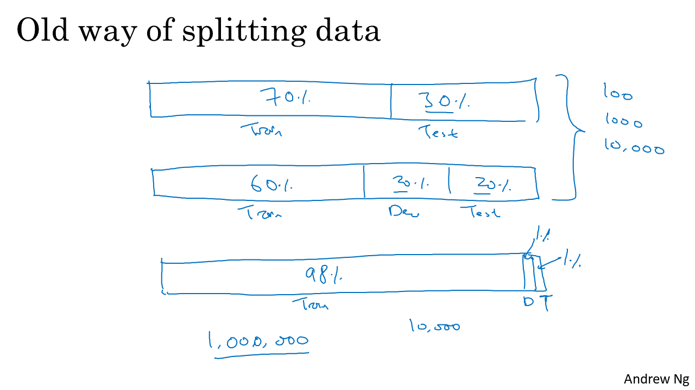
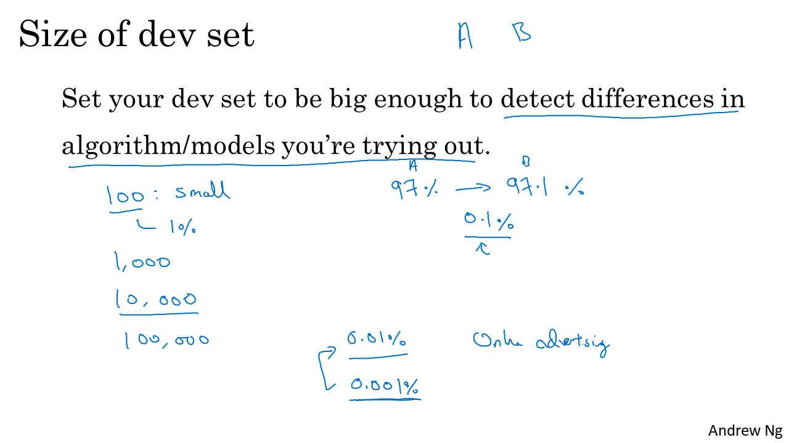
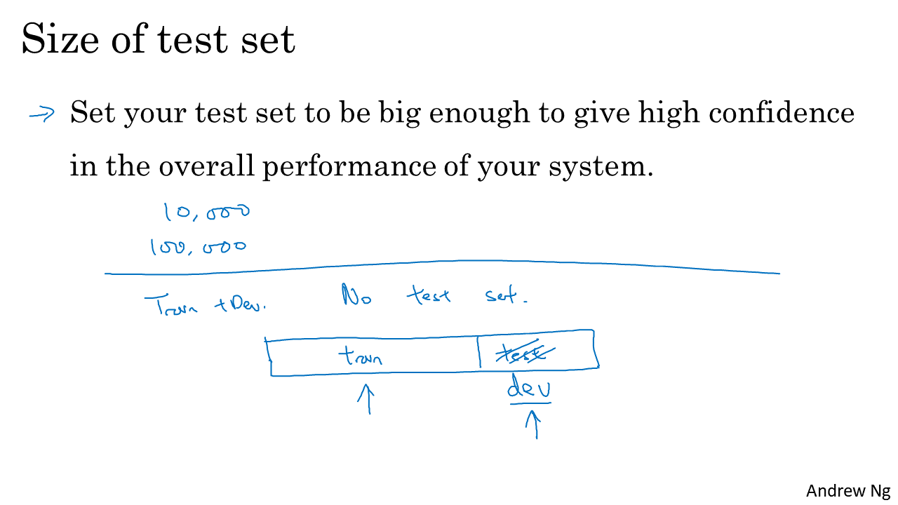

### When to change dev/test sets and metrics
[Supplemental notes](When_to_change_develpment_test_sets_and_metrics.pdf)

### Why human level performance
[Supplemental notes](Why_human_level_performance.pdf)

### Avoidable bias
[Supplemental notes](Avoidable_bias.pdf)

### Understanding human-level performance
[Supplemental notes](Understanding_human_level_performance.pdf)

### Surpassing human-level performance
[Supplemental notes](Surpassing_human_level_performance.pdf)

### Improving your model performance
[Supplemental notes](Improving_your_model_performance.pdf)

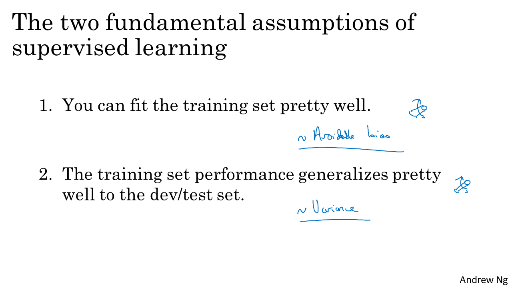
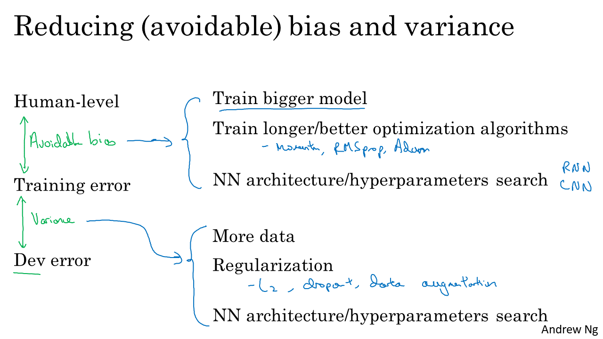

## Week 2
### Carrying out error analysis
[Github notes](https://github.com/mbadry1/DeepLearning.ai-Summary/tree/master/3-%20Structuring%20Machine%20Learning%20Projects#carrying-out-error-analysis)

### Build System Quickly
[Supplemental notes](Build_System_Quickly.pdf)

### Training and testing on different distributions
[Supplemental notes](Training_and_testing_on_different_distributions.pdf)

### Bias and Variance with mismatched data distributions
[Supplemental notes](Bias_and_variance_with_mismatched_data_distributions.pdf)

### Addressing data mismatch
[Supplemental notes](Adressing_data_mismatch.pdf)

### Transfer learning
[Supplemental notes](Transfer_Learning.pdf)

### What is end-to-end deep learning
[Supplemental notes](What_is_end_to_end_deep_learning.pdf)

### Whether to use end-to-end deep learning
[Supplemental notes](Whether_to_use_end_to_end_deep_learning.pdf)