# [Convolutional Neural Networks](https://www.coursera.org/learn/convolutional-neural-networks)

Rustam_Z🚀 | 29 November 2020

- Foundations of Convolutional Neural Networks (padding, striding, polling, FC, CNN example)

- Deep convolutional models (LeNet-5, AlexNet, VGG, ResNet, Inception)

- Object detection

- Special applications: Face recognition & Neural style transfer

- [Extra notes](https://github.com/mbadry1/DeepLearning.ai-Summary/tree/master/4-%20Convolutional%20Neural%20Networks)

- About CNN briefly: https://towardsdatascience.com/convolutional-neural-network-17fb77e76c05

- https://cs231n.github.io/convolutional-networks/

- Types of Convolutions: https://towardsdatascience.com/types-of-convolutions-in-deep-learning-717013397f4d

## Contents
- [WEEK 1 - Foundations of Convolutional Neural Networks](#WEEK-1:-Convolutional-Neural-Networks)

    - [Computer vision](#Computer-Vision)

    - [Edge detection example](#Edge-Detection-Example)

    - [More edge detection](#More-Edge-Detection) vertical and horizontal edges detection

    - [Padding](#Padding)

    - [Strided convolution](#Strided-Convolutions)

    - [Convolutions over volumes](#Convolutions-Over-Volume)

    - [One layer of a convolutional network](#One-Layer-of-a-Convolutional-Network)

    - [Simple convolution network example](Simple-Convolutional-Network-Example)

    - [Pooling layers](#Pooling-Layers)

    - [CNN Example](#CNN-Example)

    - [Why Convolutions?](#Why-Convolutions?)

- [WEEK 2: Deep convolutional models: case studies](#Week-2)
    - Case studies
        - [Why look at case studies?](#Why-look-at-case-studies?)

        - [Classic Networks](#Classic-Networks)

        - [Residual Networks (ResNets)](#ResNets)

        - [Network in Network and 1 X 1 convolutions](#Networks-in-Networks-and-1x1-Convolutions)

        - [Inception Network](#Inception-Network)

    - Practical advices for using ConvNets
        - [Transfer learning](#Transfer-learning)

        - [Data augmentation](#Data-augmentation)

- WEEK 3

- WEEK 4

## WEEK 1: Convolutional Neural Networks
### Computer Vision
 

### Edge Detection Example
  

### More Edge Detection
  

### Padding
 

### Strided Convolutions
  

### Convolutions Over Volume
  

### One Layer of a Convolutional Network
  

### Simple Convolutional Network Example
 

### Pooling Layers
   

### CNN Example
 

### Why Convolutions?
  

## WEEK 2
> Learn about the practical tricks and methods used in deep CNNs straight from the research papers.

> - Discuss multiple foundational papers written about convolutional neural networks
> - Analyze the dimensionality reduction of a volume in a very deep network
> - Implement the basic building blocks of ResNets in a deep neural network using Keras
> - Train a state-of-the-art neural network for image classification
> - Implement a skip connection in your network
> - Clone a repository from github and use transfer learning

### Case studies
### Why look at case studies?
- Some neural networks architecture that works well in some tasks can also work well in other tasks.

- Here are some classical CNN networks:
    - **LeNet-5**
    - **AlexNet**
    - **VGG**

- **ResNet** with 152 layers

- **Inception** architecture by Google is a good example to apply

### Classic Networks
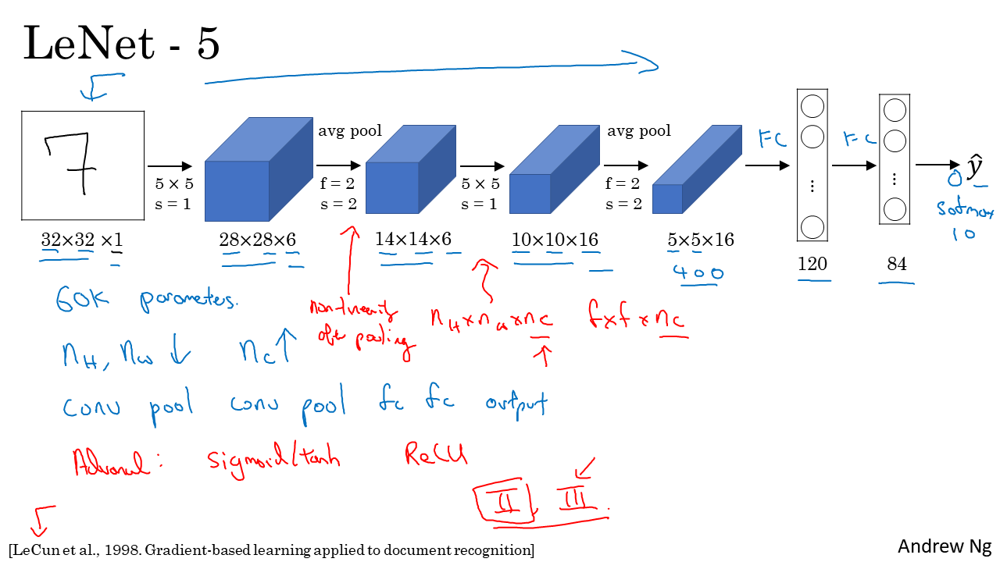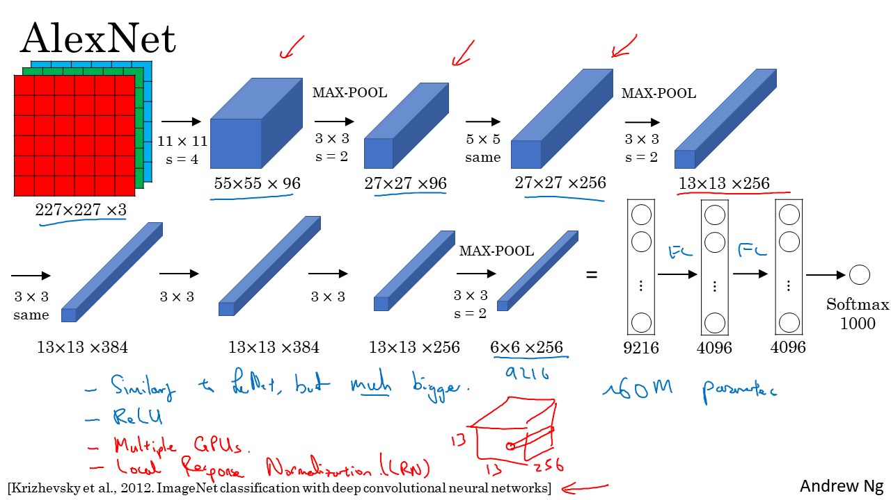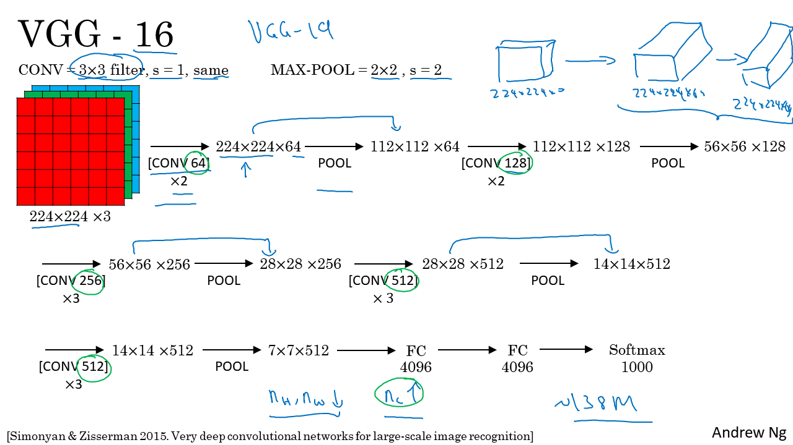

### ResNets
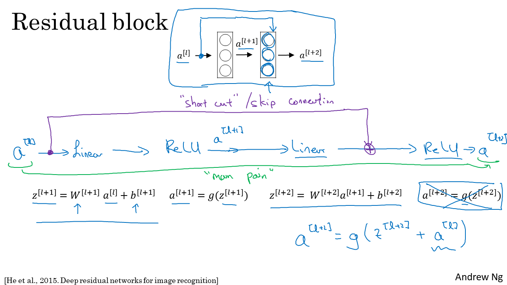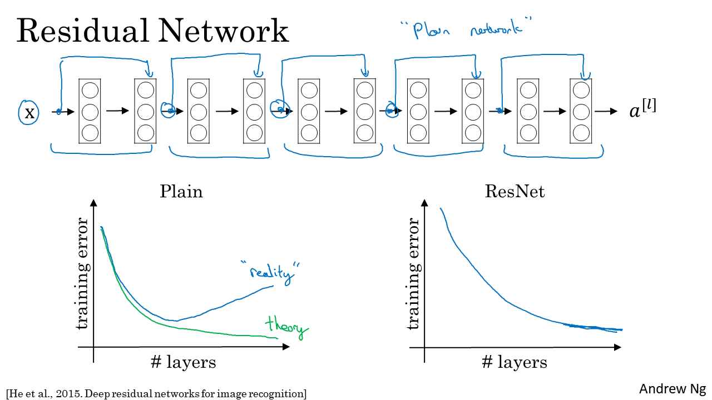
- https://github.com/mbadry1/DeepLearning.ai-Summary/tree/master/4-%20Convolutional%20Neural%20Networks#why-resnets-work

### Networks in Networks and 1x1 Convolutions
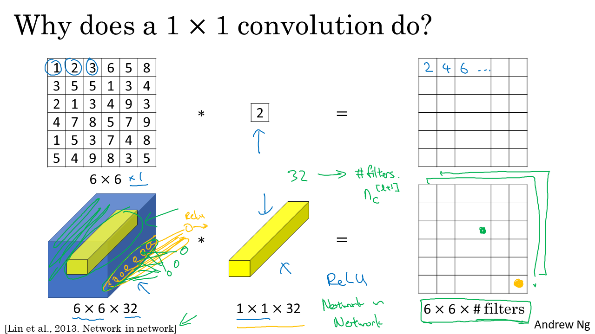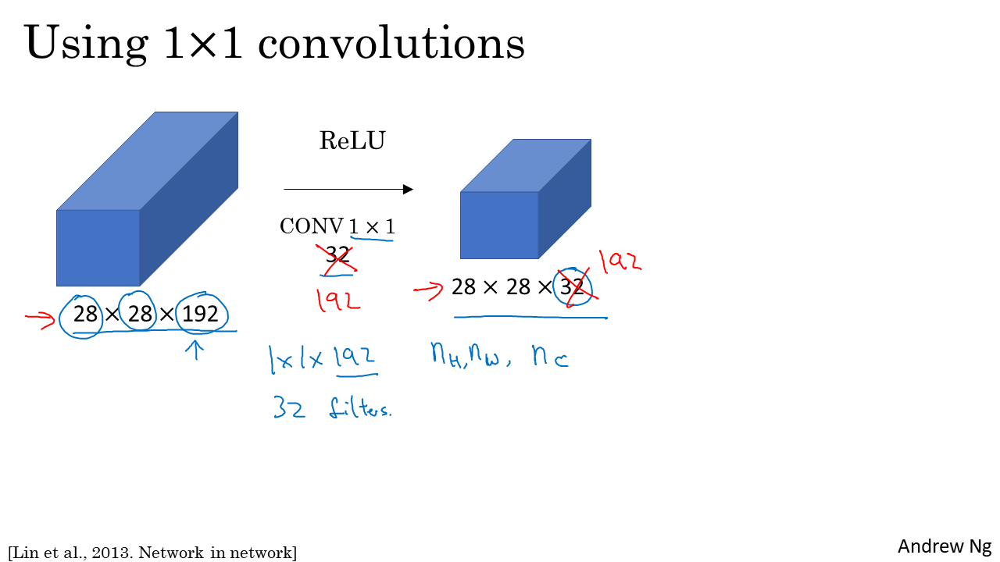
- https://github.com/mbadry1/DeepLearning.ai-Summary/tree/master/4-%20Convolutional%20Neural%20Networks#network-in-network-and-1-x-1-convolutions

### Inception Network
- ***Inception network morivation***
     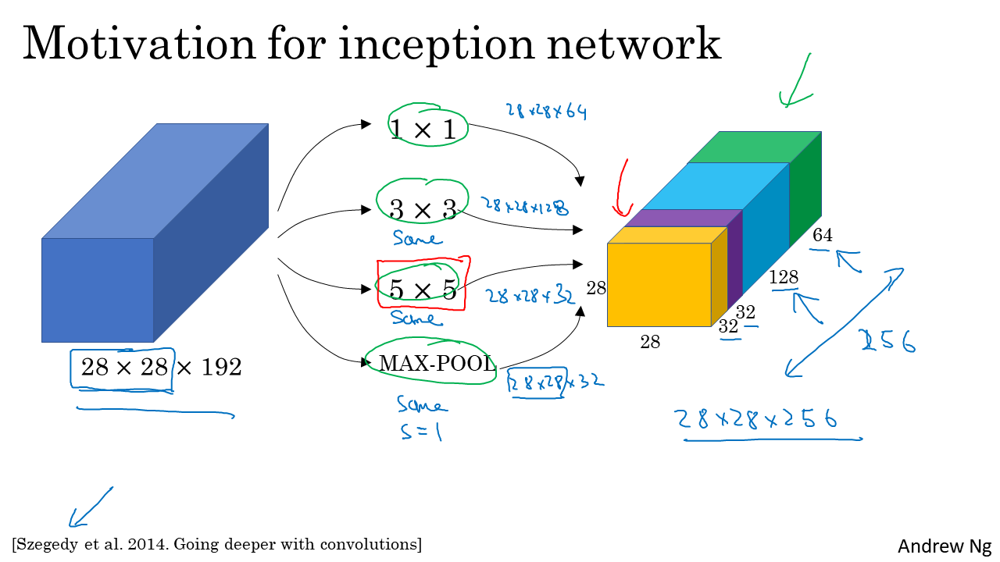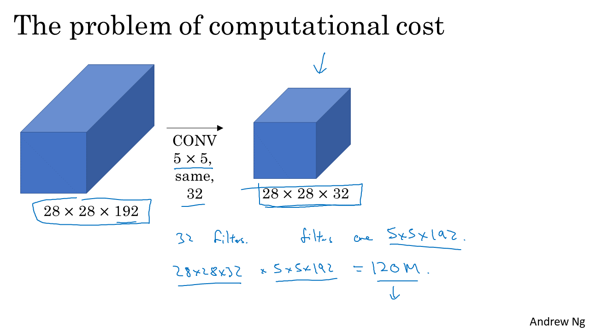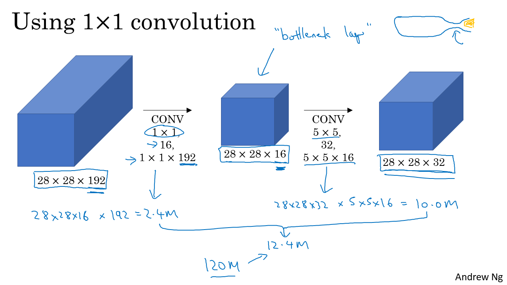

    - We could face the problem of computational cost. To overcome it we must use the 1*1 covolution.

    - https://github.com/mbadry1/DeepLearning.ai-Summary/tree/master/4-%20Convolutional%20Neural%20Networks#inception-network-motivation

- ***Inception Network***
 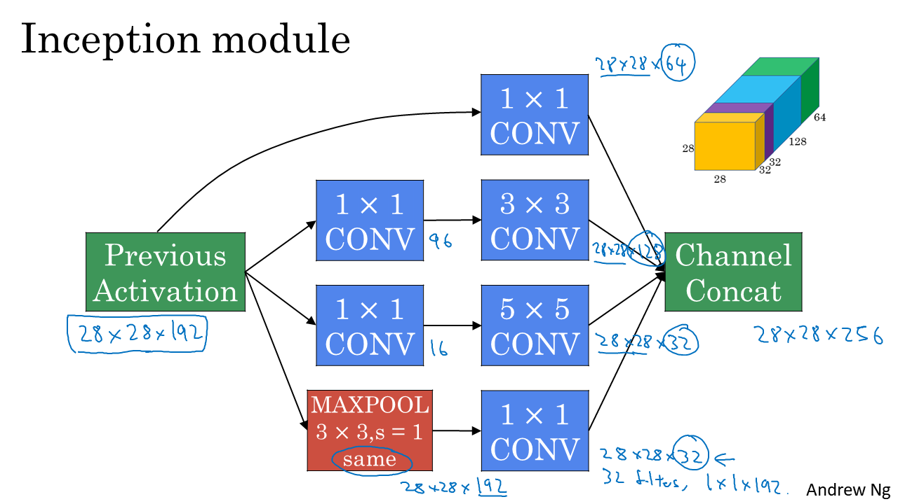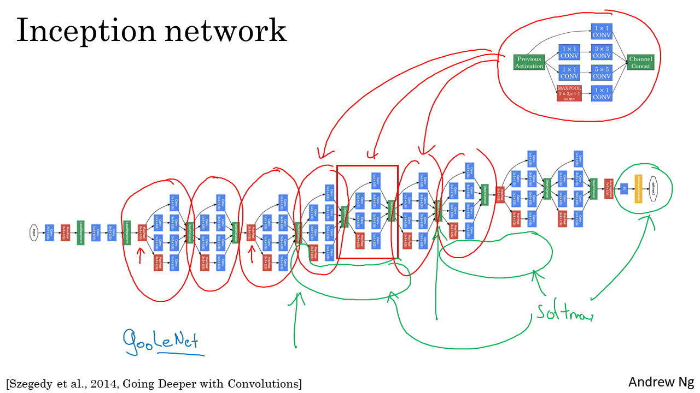

- GoogleNet - https://github.com/mbadry1/DeepLearning.ai-Summary/tree/master/4-%20Convolutional%20Neural%20Networks#inception-network-googlenet

### Practical advices for using ConvNets
### Transfer Learning
- https://github.com/mbadry1/DeepLearning.ai-Summary/tree/master/4-%20Convolutional%20Neural%20Networks#transfer-learning

### Data Augmentation
- Mirroring the picture, random cropping, rotation, shearing
 

- 

- https://github.com/mbadry1/DeepLearning.ai-Summary/tree/master/4-%20Convolutional%20Neural%20Networks#data-augmentation

- https://github.com/mbadry1/DeepLearning.ai-Summary/tree/master/4-%20Convolutional%20Neural%20Networks#state-of-computer-vision

### General notes Quiz
- Quiz analysis: https://www.programmersought.com/article/43173972595/