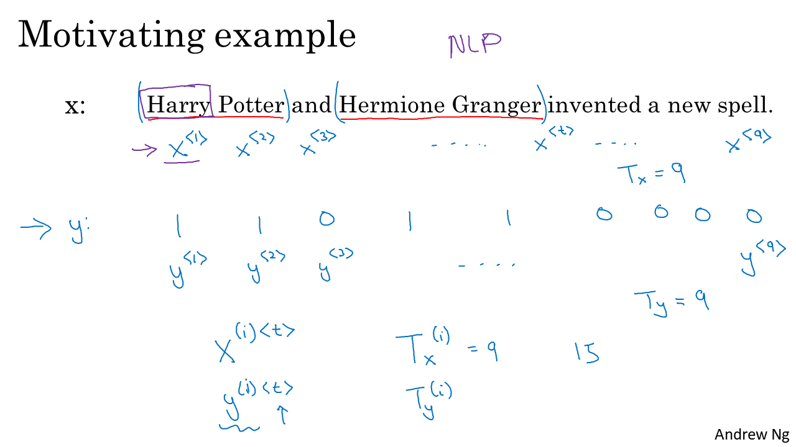
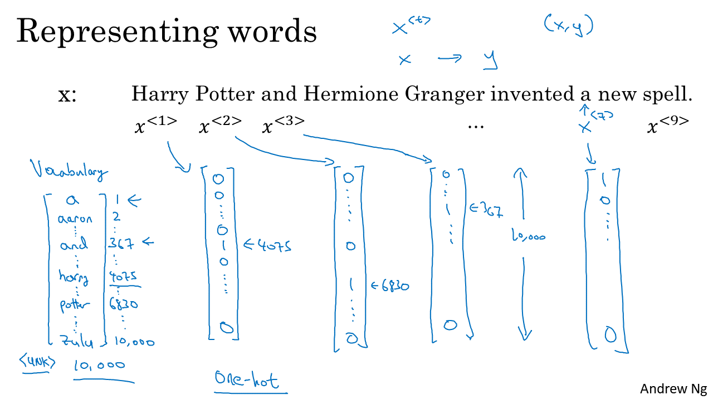
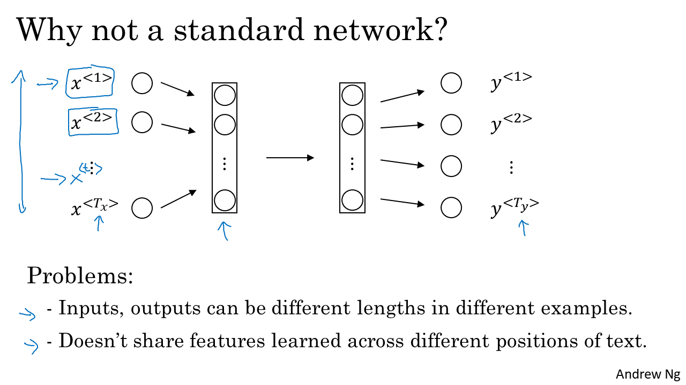
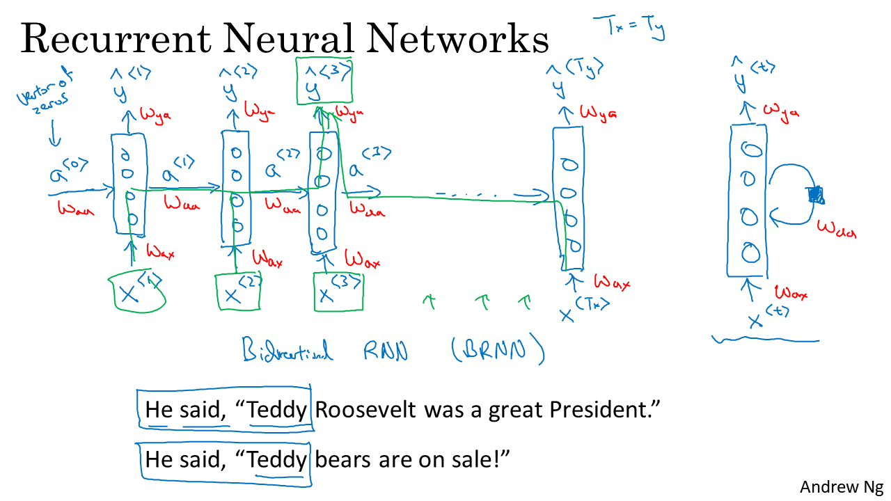
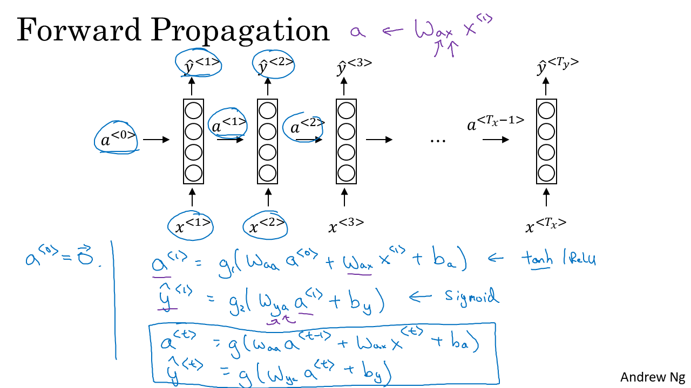
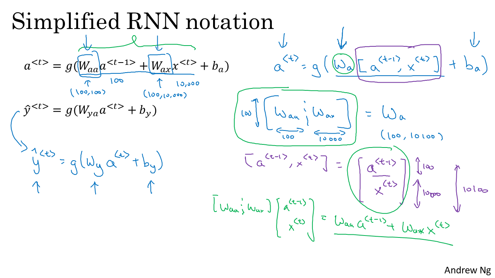

# [Sequence Models](https://www.coursera.org/learn/nlp-sequence-models) (NLP)

Rustam_Z🚀 | 20 December 2020

## Contents:
- [WEEK 1](#WEEK-1)
    - Recurrent Neural Networks 

- [WEEK 2](#WEEK-2)

- [WEEK 3](#WEEK-3)

## WEEK 1
    - Recurrent Neural Networks 
    - LSTMs, GRUs, Bidirectional RNNs
Applications: speech recognition, musics generation, machine traslation, name entity recognition...

### Notation
- The text of words is represented as the vector of words
- 

### Recurrent Neural Network Model
- 
- 

## WEEK 2

## WEEK 3