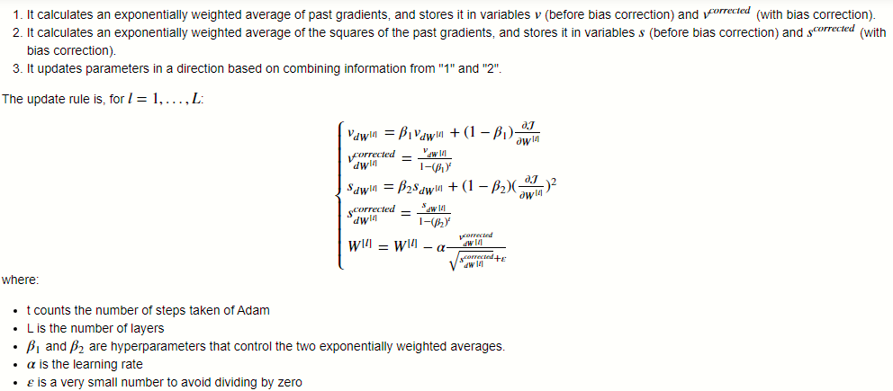
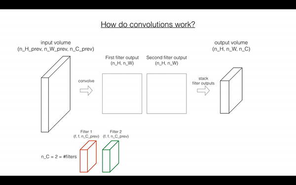

# Deep Learning Projects🚀

By Rustam_Z🚀 | December 2, 2020

Here you can find all projects I have made using Deep Learing & Neural Netowrks & CNN & TensorFlow

## Highlighted Projects:
- [Autonomous driving & Car detection](#Autonomous-driving-&-Car-detection)

- [Face Recognition](#Face-Recognition)

### [Logistic Regression as a Neural Network](Logistic-Regression-as-a-Neural-Network)
- Cat vs non-cat classification using logistic regression. You can see the architecture of model below:

- 

### [Planar data classification with one hidden layer](Planar-data-classification-with-one-hidden-layer)
- Data classification, NN with a hidden layer vs logistic regression
- Practiced with the size of a hidden layer
- 

### [Building Deep Neural Network](Building-Deep-Neural-Network)
- A deep NN with many layers using ReLU activation fuction
- Deep Learning methodology to build the model:
    - Initialize parameters/Define hyperparameters
    - Loop for num_iterations:
        1. Forward propagation
        2. Compute cost function
        3. Backward propagation
        4. Update parameters (using parameters, and grads from backprop) 
  - Use trained parameters to predict labels
- 

### [Image Classification with NN](Image-Classification-with-NN)
- Cat vs non-cat classification using 2-layer & L-layer NN

- Used the helper funtions implementations from the "Building Deep Neural Network"

- 

### [Optimization methods from scratch](Optimization_Methods) 
- Stochastic Gradient Descent, Mini-batch GD with momentum, Adam optimization

- **Adam** is one of the most effective optimization algorithms for training neural networks. It combines ideas from RMSProp and Momentum

- 

- 

### [Sign Language Detector](TensorFlow)
- First project using TensorFlow

- 

### [Convolutional Neural Networks: Application](CNNs-App)
- Sign language using the TensorFlow CNN model

- Info: training set - 95% accuracy, test set - 80% accuracy

- Used Adam optimization technique (mini batches) for minimizing the cost

- 

### [Emotion Tracking](Emotion-Tracking)
- `#keras`

- 

- **Key Points to remember**
  - Keras is a tool for rapid prototyping. It allows you to quickly try out different model architectures.

  - The four steps in Keras:
    - **Create a model** `happyModel = HappyModel(X_train.shape[1:])`

    - **Compile a model** `happyModel.compile(optimizer="adam", loss="binary_crossentropy", metrics=["accuracy"])`

    - **Fit/Train** `happyModel.fit(x = X_train, y = Y_train, epochs = 40, batch_size = 60)`

    - **Evaluate/Test** `preds = happyModel.evaluate(x = X_test, y = Y_test)`

### [ResNets](ReaNets)
- Convolutional block  

- Identity block 3  

- ResNet  

### [Autonomous driving & Car detection](Car-detection-with-YOLO)
- Implemented YOLO algorithms for detecting object. YOLO stands for 'You only look once'.

- Used object detection on a car detection dataset

- Dealed with bounding boxes

- Summary for YOLO:
  - Input image `(608, 608, 3)`
  - The input image goes through a CNN, resulting in a `(19,19,5,85)` dimensional output.
  - After flattening the last two dimensions, the output is a volume of shape `(19, 19, 425)`:
    - Each cell in a `19x19` grid over the input image gives `425` numbers.
    - `425 = 5 x 85` because each cell contains predictions for 5 boxes, corresponding to 5 anchor boxes, as seen in lecture.
    - `85 = 5 + 80` where 5 is because `(pc,bx,by,bh,bw)(pc,bx,by,bh,bw)` has 5 numbers, and 80 is the number of classes we'd like to detect
  - You then select only few boxes based on:
    - Score-thresholding: throw away boxes that have detected a class with a score less than the threshold
    - Non-max suppression: Compute the Intersection over Union and avoid selecting overlapping boxes
  - This gives you YOLO's final output.

### [Face Recognition](Face-Recognition)
- Understood difference between Face verification & Face recognition

- Model - FaceNet

- Key points:
  - Face verification solves an easier 1:1 matching problem; face recognition addresses a harder 1:K matching problem.
  - The triplet loss is an effective loss function for training a neural network to learn an encoding of a face image.
  - The same encoding can be used for verification and recognition. Measuring distances between two images' encodings allows you to determine whether they are pictures of the same person.

- 

- 

### [Neural Style Transfer](Neural-Style-Transfer)
- Implemented the neural style transfer algorithm
- Generated novel artistic images using your algorithm
- 