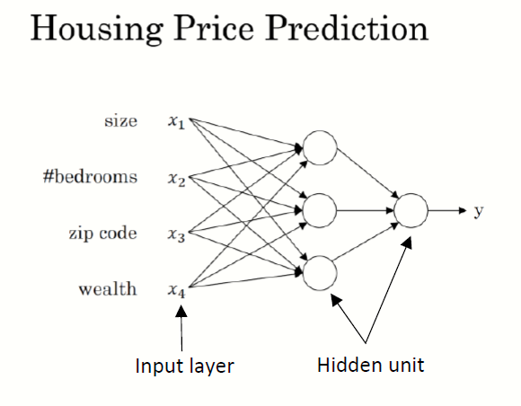
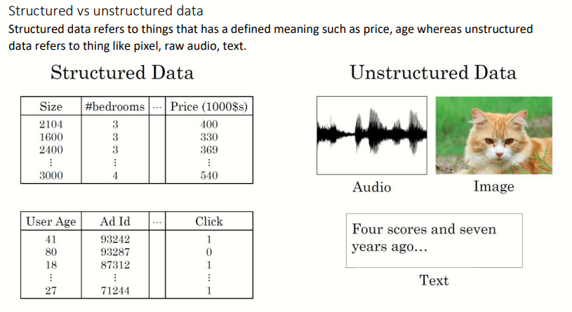

# Deep Learning Specialization | [Coursera](https://www.coursera.org/specializations/deep-learning)
Path to learning DL | Day-1: 18 October 2020

## About this Specialization
You will learn about Convolutional networks, RNNs, LSTM, Adam, Dropout, BatchNorm, Xavier/He initialization, and more. You will work on case studies from healthcare, autonomous driving, sign language reading, music generation, and natural language processing. You will master not only the theory, but also see how it is applied in industry. You will practice all these ideas in Python and in TensorFlow. 

## Agenda
- Course 1 *Neural Networks and Deep Learning* - just a start, architecture of NN
- Course 2 *Improving Deep Neural Networks: Hyperparameter tuning, Regularization and Optimization* - TensorFlow, optomization algos
- Course 3 *Structuring Machine Learning Projects* - how to build a successful machine learning projects, and how to prioritize the problem
- Course 4 *Convolutional Neural Networks* - all about CNN
- Course 5 *Natural Language Processing: Building sequence models* - Recurrent Neural Networks (RNNs), natural language processing (NLP)

Source: [coursera.org](https://www.coursera.org/specializations/deep-learning)

# Course 1 - Neural Networks and Deep Learning
You will: 
- Understand the major technology trends driving Deep Learning
- Be able to build, train and apply fully connected deep neural networks 
- Know how to implement efficient (vectorized) neural networks 
- Understand the key parameters in a neural network's architecture 

## C1 Week 1
- **Machine Learning vs Deep Learning**

- **What is neural network?** [Lecture notes](https://github.com/Rustam-Z/deep-learning/blob/main/Course%201%20Neural%20Networks%20and%20Deep%20Learning/01.%20What_is_Neural_Network.pdf)
NN is a powerful learning algorithm inspired by how the brain works.

- **Supervised Learning for Neural Networks** [Lecture notes](https://github.com/Rustam-Z/deep-learning/blob/main/Course%201%20Neural%20Networks%20and%20Deep%20Learning/02.%20Supervised_Learning_for_Neural_Network.pdf)
  - Supervised learning problems are categorized into "regression" and "classification" problems. In a regression problem, we are trying to predict results within a continuous output, meaning that we are trying to map input variables to some continuous function. In a classification problem, we are instead trying to predict results in a discrete output. In other words, we are trying to map input variables into discrete categories.  
  - **Application of supervised learning**
  
  - Types of neural networks: **Convolution Neural Network (CNN)** used often for image application and **Recurrent Neural Network (RNN)** used for one-dimensional sequence data such as translating English to Chinses. As for the autonomous driving, it is a hybrid neural network architecture.
  - **Structured vs unstructured data**
  
- **Why is Deep Learning taking off?** [Lecture notes](https://github.com/Rustam-Z/deep-learning/blob/main/Course%201%20Neural%20Networks%20and%20Deep%20Learning/03.%20Why_is_Deep_Learning_Taking_Off.pdf) 
Large amount of data! We see that traditional algorithms reach to a threshold on performance. However, NN always works better with more data. So you can get better performance as long as you collecting more and more data, without changing the algorithm itself.
  

## C1 Week 2

  